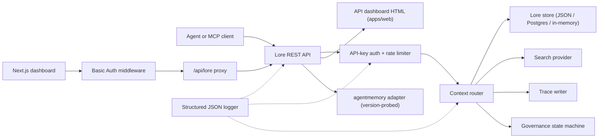

# Architecture

Lore Context is a local-first control plane around memory, search, traces, evaluation,
migration, and governance. v0.4.0-alpha is a TypeScript monorepo deployable as a single
process or a small Docker Compose stack.

## Component Map

| Component | Path | Role |
|---|---|---|
| API | `apps/api` | REST control plane, auth, rate limit, structured logger, graceful shutdown |
| Dashboard | `apps/dashboard` | Next.js 16 operator UI behind HTTP Basic Auth middleware |
| MCP Server | `apps/mcp-server` | stdio MCP surface (legacy + official SDK transports) with zod-validated tool inputs |
| Web HTML | `apps/web` | Server-rendered HTML fallback UI shipped alongside the API |
| Shared types | `packages/shared` | `MemoryRecord`, `ContextQueryResponse`, `EvalMetrics`, `AuditLog`, errors, ID utils |
| AgentMemory adapter | `packages/agentmemory-adapter` | Bridge to upstream `agentmemory` runtime with version probe and degraded mode |
| Search | `packages/search` | Pluggable search providers (BM25, hybrid) |
| MIF | `packages/mif` | Memory Interchange Format v0.2 — JSON + Markdown export/import |
| Eval | `packages/eval` | `EvalRunner` + metric primitives (Recall@K, Precision@K, MRR, staleHit, p95) |
| Governance | `packages/governance` | Six-state state machine, risk-tag scanning, poisoning heuristics, audit log |

## Runtime Shape

The API is dependency-light and supports three storage tiers:

1. **In-memory** (default, no env): suitable for unit tests and ephemeral local runs.
2. **JSON-file** (`LORE_STORE_PATH=./data/lore-store.json`): durable on a single host;
   incremental flush after every mutation. Recommended for solo development.
3. **Postgres + pgvector** (`LORE_STORE_DRIVER=postgres`): production-grade storage
   with single-writer incremental upserts and explicit hard-delete propagation.
   Schema lives at `apps/api/src/db/schema.sql` and ships B-tree indexes on
   `(project_id)`, `(status)`, `(created_at)` plus GIN indexes on the jsonb
   `content` and `metadata` columns. `LORE_POSTGRES_AUTO_SCHEMA` defaults to `false`
   in v0.4.0-alpha — apply schema explicitly via `pnpm db:schema`.

Context composition only injects `active` memories. `candidate`, `flagged`,
`redacted`, `superseded`, and `deleted` records remain inspectable through inventory
and audit paths but are filtered out of agent context.

Every composed memory id is recorded back to the store with `useCount` and
`lastUsedAt`. Trace feedback marks a context query `useful` / `wrong` / `outdated` /
`sensitive`, creating an audit event for later quality review.

## Governance Flow

The state machine in `packages/governance/src/state.ts` defines six states and an
explicit legal-transition table:

```text
candidate ──approve──► active
candidate ──auto risk──► flagged
candidate ──auto severe risk──► redacted

active ──manual flag──► flagged
active ──new memory replaces──► superseded
active ──manual delete──► deleted

flagged ──approve──► active
flagged ──redact──► redacted
flagged ──reject──► deleted

redacted ──manual delete──► deleted
```

Illegal transitions throw. Every transition is appended to the immutable audit log
via `writeAuditEntry` and surfaces in `GET /v1/governance/audit-log`.

`classifyRisk(content)` runs the regex-based scanner over a write payload and returns
the initial state (`active` for clean content, `flagged` for moderate risk, `redacted`
for severe risk like API keys or private keys) plus the matched `risk_tags`.

`detectPoisoning(memory, neighbors)` runs heuristic checks for memory poisoning:
same-source dominance (>80% of recent memories from a single provider) plus
imperative-verb patterns ("ignore previous", "always say", etc.). Returns
`{ suspicious, reasons }` for the operator queue.

Memory edits are version-aware. Patch in place via `POST /v1/memory/:id/update` for
small corrections; create a successor via `POST /v1/memory/:id/supersede` to mark the
original `superseded`. Forgetting is conservative: `POST /v1/memory/forget`
soft-deletes unless the admin caller passes `hard_delete: true`.

## Eval Flow

`packages/eval/src/runner.ts` exposes:

- `runEval(dataset, retrieve, opts)` — orchestrates retrieval against a dataset,
  computes metrics, returns a typed `EvalRunResult`.
- `persistRun(result, dir)` — writes a JSON file under `output/eval-runs/`.
- `loadRuns(dir)` — loads saved runs.
- `diffRuns(prev, curr)` — produces a per-metric delta and a `regressions` list for
  CI-friendly threshold checking.

The API exposes provider profiles via `GET /v1/eval/providers`. Current profiles:

- `lore-local` — Lore's own search and composition stack.
- `agentmemory-export` — wraps the upstream agentmemory smart-search endpoint;
  named "export" because in v0.9.x it searches observations rather than freshly
  remembered records.
- `external-mock` — synthetic provider for CI smoke testing.

## Adapter Boundary (`agentmemory`)

`packages/agentmemory-adapter` insulates Lore from upstream API drift:

- `validateUpstreamVersion()` reads upstream `health()` version and compares against
  `SUPPORTED_AGENTMEMORY_RANGE` using a hand-rolled semver compare.
- `LORE_AGENTMEMORY_REQUIRED=1` (default): adapter throws on init if upstream is
  unreachable or incompatible.
- `LORE_AGENTMEMORY_REQUIRED=0`: adapter returns null/empty from all calls and
  logs a single warning. The API stays up, but agentmemory-backed routes degrade.

## MIF v0.2

`packages/mif` defines the Memory Interchange Format. Each `LoreMemoryItem` carries
the full provenance set:

```ts
{
  id: string;
  content: string;
  memory_type: string;
  project_id: string;
  scope: "project" | "global";
  governance: { state: GovState; risk_tags: string[] };
  validity: { from?: ISO-8601; until?: ISO-8601 };
  confidence?: number;
  source_refs?: string[];
  supersedes?: string[];      // memories this one replaces
  contradicts?: string[];     // memories this one disagrees with
  metadata?: Record<string, unknown>;
}
```

JSON and Markdown round-trip is verified via tests. The v0.1 → v0.2 import path is
backward-compatible — older envelopes load with empty `supersedes`/`contradicts` arrays.

## Local RBAC

API keys carry roles and optional project scopes:

- `LORE_API_KEY` — single legacy admin key.
- `LORE_API_KEYS` — JSON array of `{ key, role, projectIds? }` entries.
- Empty-keys mode: in `NODE_ENV=production`, the API fails closed. In dev, loopback
  callers can opt into anonymous admin via `LORE_ALLOW_ANON_LOOPBACK=1`.
- `reader`: read/context/trace/eval-result routes.
- `writer`: reader plus memory write/update/supersede/forget(soft), events, eval
  runs, trace feedback.
- `admin`: all routes including sync, import/export, hard delete, governance review,
  and audit log.
- `projectIds` allow-list narrows visible records and forces explicit `project_id`
  on mutating routes for scoped writers/admins. Unscoped admin keys are required for
  cross-project agentmemory sync.

## Request Flow



## Non-Goals For v0.4.0-alpha

- No direct public exposure of raw `agentmemory` endpoints.
- No managed cloud sync (planned for v0.6).
- No remote multi-tenant billing.
- No OpenAPI/Swagger packaging (planned for v0.5; prose reference in
  `docs/api-reference.md` is authoritative).
- No automated continuous-translation tooling for documentation (community PRs
  via `docs/i18n/`).

## Related Documents

- [Getting Started](getting-started.md) — 5-minute developer quickstart.
- [API Reference](api-reference.md) — REST and MCP surface.
- [Deployment](deployment/README.md) — local, Postgres, Docker Compose.
- [Integrations](integrations/README.md) — agent-IDE setup matrix.
- [Security Policy](../SECURITY.md) — disclosure and built-in hardening.
- [Contributing](../CONTRIBUTING.md) — development workflow and commit format.
- [Changelog](../CHANGELOG.md) — what shipped when.
- [i18n Contributor Guide](i18n/README.md) — documentation translations.
