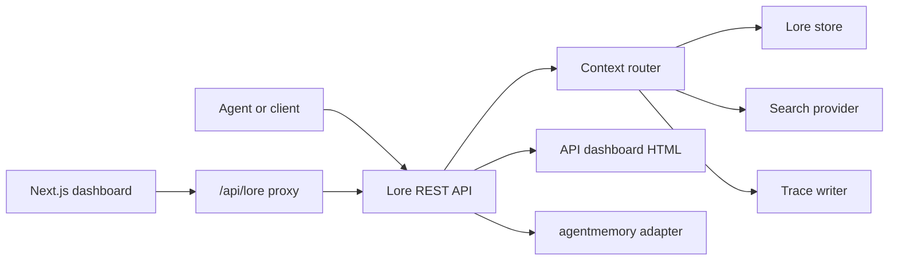

# Architecture

Lore Context is a local-first control plane around memory, search, traces, evaluation, migration, and governance.

Initial boundaries:

- `apps/api`: REST API and control-plane services.
- `apps/dashboard`: standalone Next.js operator dashboard with same-origin proxy routes to the Lore API.
- `apps/mcp-server`: small MCP surface for agent clients.
- `apps/web`: API-served dashboard HTML shell for zero-extra-process local use.
- `packages/shared`: shared types and errors.
- `packages/agentmemory-adapter`: integration boundary for the local agentmemory runtime.
- `packages/search`: search provider interface and implementations.
- `packages/mif`: import and export helpers.
- `packages/eval`: retrieval-evaluation metrics and runners.
- `packages/governance`: risk tagging, policy, and scanners.

## Runtime Shape

The current MVP keeps the API dependency-light:

- Default store: in-memory maps for local tests and short runs.
- Durable local store: optional JSON snapshot controlled by `LORE_STORE_PATH`.
- Team/local database store: optional Postgres plus pgvector, using `apps/api/src/db/schema.sql` as the starting contract. `LORE_STORE_DRIVER=postgres` activates it, and `pnpm smoke:postgres` verifies a write-restart-read round trip against the local Docker pgvector service.

`LORE_STORE_PATH` persists memories, context traces, events, eval runs, and audit logs after every mutating operation. This is intentionally simple so agents can run the service locally without a database. The Postgres driver mirrors the same store shape into normalized control-plane tables using a single-writer incremental flush: rows are written with idempotent upserts, and explicit hard deletes are propagated with targeted memory deletes instead of table-wide resets.

Context composition only uses `active` and `confirmed` memories. Candidate, superseded, expired, and deleted records remain inspectable through inventory and audit paths but are not injected into agent context by default.

Every composed memory id is recorded back to the store with `useCount` and `lastUsedAt`. Trace feedback can mark a context query `useful`, `wrong`, `outdated`, or `sensitive`, creating an audit event for later quality review.

Eval runs can be submitted through REST or either dashboard playground. The API exposes provider profiles through `GET /v1/eval/providers`; current profiles are `lore-local`, `agentmemory-export`, and `external-mock`. `agentmemory-export` is deliberately named this way because the live `agentmemory` 0.9.3 smart-search endpoint searches observations, not freshly remembered memory records.

The first demo-ready flow is the `demo-private` package under `examples/demo-dataset`: seed memories, run provider comparisons, inspect traces, then export a Markdown eval report. This keeps the project focused on user-owned dataset proof instead of generic benchmark claims.

The MIF-like JSON and Markdown import paths preserve governance fields such as status, validity, supersession links, source provenance, risk tags, metadata, and usage counters where the source format carries them.

## Governance Flow

High-risk memory writes are redacted and stored as `candidate` records. Operators can review them through the dashboard or REST API:

- `GET /v1/governance/review-queue`
- `POST /v1/governance/memory/:id/approve`
- `POST /v1/governance/memory/:id/reject`

Approval promotes a memory to `confirmed`; rejection soft-deletes it. Both actions are audit logged.

Memory edits are version-aware. Operators can patch a record in place for small corrections, or call `POST /v1/memory/:id/supersede` to create a new record while marking the previous one `superseded`.

Memory forgetting is conservative by default. `POST /v1/memory/forget` soft-deletes records unless the admin caller passes `hard_delete: true`, which physically removes the record from the active store and records the removal choice in the audit log.

## Local RBAC

The local API supports API key roles without adding an auth dependency:

- `LORE_API_KEY` is a legacy single admin key.
- `LORE_API_KEYS` accepts a JSON array of `{ "key": "...", "role": "reader|writer|admin" }`.
- When no key is configured, unkeyed access is limited to loopback requests for local development.
- `reader` can use read/context/trace/eval-result routes.
- `writer` can additionally write or update memories, submit events, run eval, and add trace feedback.
- `admin` can sync/import/export/forget, review governance queue items, and read audit logs. Hard delete is only reachable through this admin-only forget path.
- Optional `projectIds` on an API key narrows visible memories, traces, eval runs, dashboard rows, and audit rows. Project-scoped writer/admin keys must mutate records inside an allowed `project_id`; full `agentmemory` sync requires an unscoped admin key because it is a cross-project import.

## Request Flow

## Non-Goals For The Local MVP

- No direct public exposure of raw `agentmemory` endpoints.
- No cloud deployment before local build, tests, smoke, API-key protection, and secrets scan pass.
- No remote sync until the local RBAC, hard-delete, audit, dashboard smoke, private Compose, and Postgres paths are verified under deployment-like settings.
