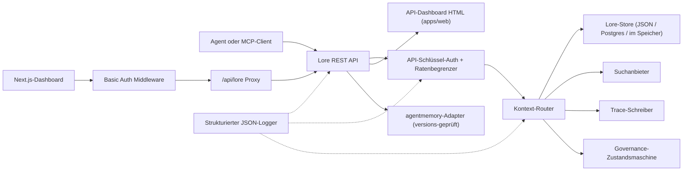

> 🤖 Dieses Dokument wurde maschinell aus dem Englischen übersetzt. Verbesserungen per PR sind willkommen — siehe [Übersetzungs-Beitragsleitfaden](../README.md).

# Architektur

Lore Context ist eine Local-First-Steuerungsebene für Speicher, Suche, Traces, Evaluation,
Migration und Governance. v0.4.0-alpha ist ein TypeScript-Monorepo, das als einzelner
Prozess oder als kleiner Docker Compose-Stack deploybar ist.

## Komponenten-Übersicht

| Komponente | Pfad | Rolle |
|---|---|---|
| API | `apps/api` | REST-Steuerungsebene, Auth, Ratenbegrenzung, strukturierter Logger, geordnetes Herunterfahren |
| Dashboard | `apps/dashboard` | Next.js 16 Operator-UI hinter HTTP Basic Auth Middleware |
| MCP-Server | `apps/mcp-server` | stdio MCP-Oberfläche (Legacy + offizielle SDK-Transporte) mit zod-validierten Tool-Eingaben |
| Web HTML | `apps/web` | Server-gerenderter HTML-Fallback-UI, der zusammen mit der API ausgeliefert wird |
| Gemeinsame Typen | `packages/shared` | `MemoryRecord`, `ContextQueryResponse`, `EvalMetrics`, `AuditLog`, Fehler, ID-Hilfsprogramme |
| AgentMemory-Adapter | `packages/agentmemory-adapter` | Brücke zur Upstream-`agentmemory`-Runtime mit Versions-Probe und Degraded-Mode |
| Suche | `packages/search` | Pluggable Suchanbieter (BM25, hybrid) |
| MIF | `packages/mif` | Memory Interchange Format v0.2 — JSON + Markdown Export/Import |
| Eval | `packages/eval` | `EvalRunner` + Metrik-Primitive (Recall@K, Precision@K, MRR, staleHit, p95) |
| Governance | `packages/governance` | Sechszustands-Zustandsmaschine, Risiko-Tag-Scanning, Vergiftungs-Heuristiken, Audit-Protokoll |

## Laufzeit-Form

Die API ist abhängigkeitsarm und unterstützt drei Speicher-Tiers:

1. **Im Speicher** (Standard, kein Env): geeignet für Unit-Tests und ephemere lokale Läufe.
2. **JSON-Datei** (`LORE_STORE_PATH=./data/lore-store.json`): dauerhaft auf einem einzelnen Host;
   inkrementelles Schreiben nach jeder Mutation. Empfohlen für Solo-Entwicklung.
3. **Postgres + pgvector** (`LORE_STORE_DRIVER=postgres`): produktionsreifer Speicher
   mit Single-Writer inkrementellen Upserts und expliziter Hard-Delete-Propagation.
   Schema liegt unter `apps/api/src/db/schema.sql` und enthält B-tree-Indizes auf
   `(project_id)`, `(status)`, `(created_at)` plus GIN-Indizes auf den jsonb-Spalten
   `content` und `metadata`. `LORE_POSTGRES_AUTO_SCHEMA` ist in v0.4.0-alpha standardmäßig `false` —
   Schema explizit über `pnpm db:schema` anwenden.

Kontext-Komposition injiziert nur `active`-Speicher. `candidate`-, `flagged`-,
`redacted`-, `superseded`- und `deleted`-Datensätze bleiben über Inventar-
und Audit-Pfade inspizierbar, werden aber aus dem Agenten-Kontext herausgefiltert.

Jede zusammengesetzte Speicher-ID wird mit `useCount` und
`lastUsedAt` zurück in den Store geschrieben. Trace-Feedback markiert eine Kontext-Abfrage als `useful` / `wrong` / `outdated` /
`sensitive`, was ein Audit-Event zur späteren Qualitätsprüfung erzeugt.

## Governance-Flow

Die Zustandsmaschine in `packages/governance/src/state.ts` definiert sechs Zustände und eine
explizite Übergangstabelle:

```text
candidate ──approve──► active
candidate ──auto risk──► flagged
candidate ──auto severe risk──► redacted

active ──manual flag──► flagged
active ──new memory replaces──► superseded
active ──manual delete──► deleted

flagged ──approve──► active
flagged ──redact──► redacted
flagged ──reject──► deleted

redacted ──manual delete──► deleted
```

Illegale Übergänge werfen Fehler. Jeder Übergang wird über `writeAuditEntry` an das unveränderliche
Audit-Protokoll angehängt und taucht in `GET /v1/governance/audit-log` auf.

`classifyRisk(content)` führt den regex-basierten Scanner über eine Schreib-Payload aus und gibt
den Anfangszustand zurück (`active` für saubere Inhalte, `flagged` für mittleres Risiko, `redacted`
für schwerwiegendes Risiko wie API-Schlüssel oder private Schlüssel) plus die übereinstimmenden `risk_tags`.

`detectPoisoning(memory, neighbors)` führt heuristische Prüfungen auf Speichervergiftung durch:
Same-Source-Dominanz (>80% der letzten Speicher von einem einzelnen Anbieter) plus
Imperativ-Verb-Muster („ignore previous", „always say" usw.). Gibt
`{ suspicious, reasons }` für die Operator-Warteschlange zurück.

Speicher-Bearbeitungen sind versionsbasiert. In-place-Patch via `POST /v1/memory/:id/update` für
kleine Korrekturen; einen Nachfolger erstellen via `POST /v1/memory/:id/supersede`, um das Original
als `superseded` zu markieren. Vergessen ist konservativ: `POST /v1/memory/forget`
löscht soft, außer der Admin-Aufrufer übergibt `hard_delete: true`.

## Eval-Flow

`packages/eval/src/runner.ts` stellt bereit:

- `runEval(dataset, retrieve, opts)` — orchestriert den Abruf gegen einen Datensatz,
  berechnet Metriken, gibt ein typisiertes `EvalRunResult` zurück.
- `persistRun(result, dir)` — schreibt eine JSON-Datei unter `output/eval-runs/`.
- `loadRuns(dir)` — lädt gespeicherte Durchläufe.
- `diffRuns(prev, curr)` — erzeugt ein Pro-Metrik-Delta und eine `regressions`-Liste für
  CI-freundliche Schwellenwertprüfung.

Die API stellt Anbieter-Profile über `GET /v1/eval/providers` bereit. Aktuelle Profile:

- `lore-local` — Lores eigener Such- und Kompositions-Stack.
- `agentmemory-export` — umhüllt den Upstream-agentmemory Smart-Search-Endpunkt;
  „export" genannt, weil es in v0.9.x Beobachtungen und nicht frisch gespeicherte Datensätze durchsucht.
- `external-mock` — synthetischer Anbieter für CI-Smoke-Tests.

## Adapter-Grenze (`agentmemory`)

`packages/agentmemory-adapter` schützt Lore vor Upstream-API-Drift:

- `validateUpstreamVersion()` liest die Upstream-`health()`-Version und vergleicht sie gegen
  `SUPPORTED_AGENTMEMORY_RANGE` mittels handcodiertem Semver-Vergleich.
- `LORE_AGENTMEMORY_REQUIRED=1` (Standard): Adapter wirft bei der Initialisierung, wenn Upstream
  nicht erreichbar oder inkompatibel ist.
- `LORE_AGENTMEMORY_REQUIRED=0`: Adapter gibt bei allen Aufrufen null/leer zurück und
  protokolliert eine einzige Warnung. Die API bleibt hoch, aber agentmemory-gestützte Routen degradieren.

## MIF v0.2

`packages/mif` definiert das Memory Interchange Format. Jedes `LoreMemoryItem` trägt
den vollständigen Herkunftssatz:

```ts
{
  id: string;
  content: string;
  memory_type: string;
  project_id: string;
  scope: "project" | "global";
  governance: { state: GovState; risk_tags: string[] };
  validity: { from?: ISO-8601; until?: ISO-8601 };
  confidence?: number;
  source_refs?: string[];
  supersedes?: string[];      // Speicher, den dieser ersetzt
  contradicts?: string[];     // Speicher, dem dieser widerspricht
  metadata?: Record<string, unknown>;
}
```

JSON- und Markdown-Round-Trip wird durch Tests verifiziert. Der v0.1 → v0.2 Import-Pfad ist
rückwärtskompatibel — ältere Envelopes laden mit leeren `supersedes`/`contradicts`-Arrays.

## Lokales RBAC

API-Schlüssel tragen Rollen und optionale Projekt-Scopes:

- `LORE_API_KEY` — einzelner Legacy-Admin-Schlüssel.
- `LORE_API_KEYS` — JSON-Array von `{ key, role, projectIds? }`-Einträgen.
- Leere-Schlüssel-Modus: in `NODE_ENV=production` schlägt die API fehl. In Dev können Loopback-
  Aufrufer sich für anonymen Admin über `LORE_ALLOW_ANON_LOOPBACK=1` entscheiden.
- `reader`: Lese/Kontext/Trace/Eval-Ergebnis-Routen.
- `writer`: reader plus Speicher-Schreiben/Aktualisieren/Ersetzen/Vergessen (soft), Events, Eval-
  Durchläufe, Trace-Feedback.
- `admin`: alle Routen inklusive Sync, Import/Export, Hard-Delete, Governance-Review
  und Audit-Protokoll.
- `projectIds`-Allowlist schränkt sichtbare Datensätze ein und erzwingt explizite `project_id`
  auf mutierenden Routen für bereichsbezogene Writer/Admins. Unbereichsbezogene Admin-Schlüssel sind für
  projektübergreifende agentmemory-Synchronisierung erforderlich.

## Request-Flow



## Nicht-Ziele für v0.4.0-alpha

- Kein direkter öffentlicher Zugriff auf rohe `agentmemory`-Endpunkte.
- Keine verwaltete Cloud-Synchronisierung (geplant für v0.6).
- Keine Remote-Multi-Mandanten-Abrechnung.
- Kein OpenAPI/Swagger-Packaging (geplant für v0.5; Prosa-Referenz in
  `docs/api-reference.md` ist maßgeblich).
- Kein automatisiertes kontinuierliches Übersetzungs-Tooling für Dokumentation (Community-PRs
  über `docs/i18n/`).

## Verwandte Dokumente

- [Erste Schritte](../../getting-started.md) — 5-Minuten-Entwickler-Schnellstart.
- [API-Referenz](../../api-reference.md) — REST- und MCP-Oberfläche.
- [Deployment](../../deployment/README.md) — lokal, Postgres, Docker Compose.
- [Integrationen](../../integrations/README.md) — Agenten-IDE-Setup-Matrix.
- [Sicherheitsrichtlinie](../../../SECURITY.md) — Offenlegung und eingebaute Härtung.
- [Mitwirken](../../../CONTRIBUTING.md) — Entwicklungsworkflow und Commit-Format.
- [Changelog](../../../CHANGELOG.md) — was wann ausgeliefert wurde.
- [i18n-Beitragsleitfaden](../README.md) — Dokumentationsübersetzungen.
