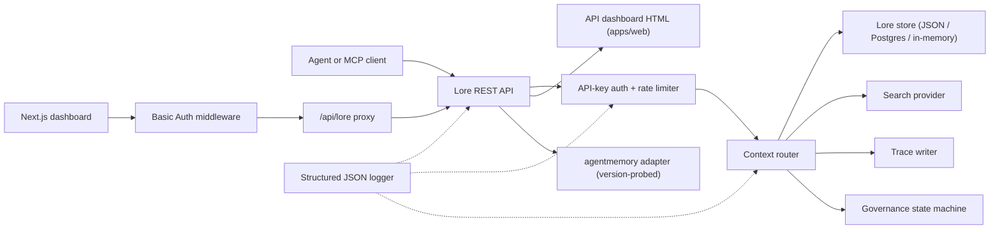

> 🤖 Αυτό το έγγραφο μεταφράστηκε αυτόματα από τα Αγγλικά. Καλωσορίζονται βελτιώσεις μέσω PR — δείτε τον [οδηγό συνεισφοράς μετάφρασης](../README.md).

# Αρχιτεκτονική

Το Lore Context είναι ένα local-first επίπεδο ελέγχου γύρω από μνήμη, αναζήτηση, ίχνη,
αξιολόγηση, μετανάστευση και διακυβέρνηση. Το v0.4.0-alpha είναι ένα TypeScript monorepo
αναπτύσσιμο ως μία μόνο διεργασία ή ένα μικρό Docker Compose stack.

## Χάρτης Στοιχείων

| Στοιχείο | Διαδρομή | Ρόλος |
|---|---|---|
| API | `apps/api` | REST επίπεδο ελέγχου, auth, όριο ρυθμού, δομημένος logger, ομαλός τερματισμός |
| Dashboard | `apps/dashboard` | Next.js 16 UI operator πίσω από ενδιάμεσο λογισμικό HTTP Basic Auth |
| MCP Server | `apps/mcp-server` | stdio MCP επιφάνεια (legacy + official SDK transports) με zod-validated εισόδους εργαλείων |
| Web HTML | `apps/web` | Server-rendered HTML fallback UI αποστελλόμενο παράλληλα με το API |
| Shared types | `packages/shared` | `MemoryRecord`, `ContextQueryResponse`, `EvalMetrics`, `AuditLog`, σφάλματα, ID utils |
| AgentMemory adapter | `packages/agentmemory-adapter` | Bridge στο upstream `agentmemory` runtime με ανίχνευση έκδοσης και degraded mode |
| Search | `packages/search` | Pluggable πάροχοι αναζήτησης (BM25, hybrid) |
| MIF | `packages/mif` | Memory Interchange Format v0.2 — JSON + Markdown εξαγωγή/εισαγωγή |
| Eval | `packages/eval` | `EvalRunner` + metric primitives (Recall@K, Precision@K, MRR, staleHit, p95) |
| Governance | `packages/governance` | Μηχανή κατάστασης έξι καταστάσεων, σάρωση ετικετών κινδύνου, ευρετικές δηλητηρίασης, αρχείο ελέγχου |

## Σχήμα Runtime

Το API έχει ελάχιστες εξαρτήσεις και υποστηρίζει τρία επίπεδα αποθήκευσης:

1. **In-memory** (προεπιλογή, χωρίς env): κατάλληλο για unit tests και εφήμερες τοπικές εκτελέσεις.
2. **JSON-file** (`LORE_STORE_PATH=./data/lore-store.json`): ανθεκτικό σε έναν host·
   αυξητική εκκαθάριση μετά από κάθε μεταβολή. Συνιστάται για solo ανάπτυξη.
3. **Postgres + pgvector** (`LORE_STORE_DRIVER=postgres`): αποθήκευση παραγωγικού επιπέδου
   με αυξητικά upserts single-writer και ρητή διάδοση σκληρής διαγραφής.
   Το schema βρίσκεται στο `apps/api/src/db/schema.sql` και αποστέλλεται με B-tree ευρετήρια σε
   `(project_id)`, `(status)`, `(created_at)` συν GIN ευρετήρια στις jsonb
   στήλες `content` και `metadata`. Το `LORE_POSTGRES_AUTO_SCHEMA` προεπιλέγεται σε `false`
   στο v0.4.0-alpha — εφαρμόστε το schema ρητά μέσω `pnpm db:schema`.

Η σύνθεση πλαισίου εισάγει μόνο `active` μνήμες. Οι `candidate`, `flagged`,
`redacted`, `superseded` και `deleted` εγγραφές παραμένουν επιθεωρήσιμες μέσω
διαδρομών inventory και ελέγχου αλλά φιλτράρονται από το πλαίσιο agent.

Κάθε composed memory id καταγράφεται πίσω στο store με `useCount` και
`lastUsedAt`. Η ανατροφοδότηση ίχνους επισημαίνει ένα context query ως `useful` / `wrong` / `outdated` /
`sensitive`, δημιουργώντας ένα audit event για μεταγενέστερη ανασκόπηση ποιότητας.

## Ροή Διακυβέρνησης

Η μηχανή κατάστασης στο `packages/governance/src/state.ts` ορίζει έξι καταστάσεις και έναν
ρητό νομικό πίνακα μεταβάσεων:

```text
candidate ──approve──► active
candidate ──auto risk──► flagged
candidate ──auto severe risk──► redacted

active ──manual flag──► flagged
active ──new memory replaces──► superseded
active ──manual delete──► deleted

flagged ──approve──► active
flagged ──redact──► redacted
flagged ──reject──► deleted

redacted ──manual delete──► deleted
```

Οι παράνομες μεταβάσεις ρίχνουν εξαίρεση. Κάθε μετάβαση προσαρτάται στο αμετάβλητο αρχείο ελέγχου
μέσω `writeAuditEntry` και εμφανίζεται στο `GET /v1/governance/audit-log`.

Η `classifyRisk(content)` εκτελεί τον σαρωτή βασισμένο σε regex πάνω από ένα ωφέλιμο φορτίο εγγραφής
και επιστρέφει την αρχική κατάσταση (`active` για καθαρό περιεχόμενο, `flagged` για μέτριο κίνδυνο,
`redacted` για σοβαρό κίνδυνο όπως API keys ή private keys) συν τις αντιστοιχισμένες `risk_tags`.

Η `detectPoisoning(memory, neighbors)` εκτελεί ευρετικούς ελέγχους για δηλητηρίαση μνήμης:
κυριαρχία ίδιας πηγής (>80% πρόσφατων μνημών από έναν μόνο πάροχο) συν
μοτίβα imperative-verb ("ignore previous", "always say", κ.λπ.). Επιστρέφει
`{ suspicious, reasons }` για την ουρά του operator.

Οι επεξεργασίες μνήμης είναι version-aware. Patch in place μέσω `POST /v1/memory/:id/update` για
μικρές διορθώσεις· δημιουργήστε διάδοχο μέσω `POST /v1/memory/:id/supersede` για να επισημάνετε
το αρχικό ως `superseded`. Η λήθη είναι συντηρητική: το `POST /v1/memory/forget`
κάνει soft-delete εκτός αν ο admin καλών περάσει `hard_delete: true`.

## Ροή Eval

Το `packages/eval/src/runner.ts` εκθέτει:

- `runEval(dataset, retrieve, opts)` — ενορχηστρώνει ανάκτηση σε σύνολο δεδομένων,
  υπολογίζει μετρικά, επιστρέφει τυποποιημένο `EvalRunResult`.
- `persistRun(result, dir)` — γράφει αρχείο JSON στο `output/eval-runs/`.
- `loadRuns(dir)` — φορτώνει αποθηκευμένες εκτελέσεις.
- `diffRuns(prev, curr)` — παράγει delta ανά μετρικό και λίστα `regressions` για
  έλεγχο threshold φιλικό προς CI.

Το API εκθέτει προφίλ παρόχων μέσω `GET /v1/eval/providers`. Τρέχοντα προφίλ:

- `lore-local` — το δικό του stack αναζήτησης και σύνθεσης Lore.
- `agentmemory-export` — τυλίγει το upstream agentmemory smart-search endpoint·
  ονομάζεται "export" επειδή στο v0.9.x αναζητά παρατηρήσεις και όχι freshly
  remembered εγγραφές.
- `external-mock` — συνθετικός πάροχος για CI smoke testing.

## Σύνορο Adapter (`agentmemory`)

Το `packages/agentmemory-adapter` μονώνει το Lore από upstream API drift:

- Η `validateUpstreamVersion()` διαβάζει την upstream `health()` έκδοση και συγκρίνει έναντι
  `SUPPORTED_AGENTMEMORY_RANGE` χρησιμοποιώντας χειροποίητη σύγκριση semver.
- `LORE_AGENTMEMORY_REQUIRED=1` (προεπιλογή): ο adapter ρίχνει εξαίρεση κατά την αρχικοποίηση αν
  το upstream είναι μη προσβάσιμο ή ασύμβατο.
- `LORE_AGENTMEMORY_REQUIRED=0`: ο adapter επιστρέφει null/empty από όλες τις κλήσεις και
  καταγράφει μία μόνο προειδοποίηση. Το API παραμένει ενεργό, αλλά οι διαδρομές agentmemory-backed
  υποβαθμίζονται.

## MIF v0.2

Το `packages/mif` ορίζει το Memory Interchange Format. Κάθε `LoreMemoryItem` φέρει
το πλήρες σύνολο provenance:

```ts
{
  id: string;
  content: string;
  memory_type: string;
  project_id: string;
  scope: "project" | "global";
  governance: { state: GovState; risk_tags: string[] };
  validity: { from?: ISO-8601; until?: ISO-8601 };
  confidence?: number;
  source_refs?: string[];
  supersedes?: string[];      // memories this one replaces
  contradicts?: string[];     // memories this one disagrees with
  metadata?: Record<string, unknown>;
}
```

Ο κύκλος μεταφοράς JSON και Markdown επαληθεύεται μέσω tests. Η διαδρομή εισαγωγής
v0.1 → v0.2 είναι backward-compatible — παλαιότερα envelopes φορτώνουν με κενούς
πίνακες `supersedes`/`contradicts`.

## Τοπικό RBAC

Τα API keys φέρουν ρόλους και προαιρετικά project scopes:

- `LORE_API_KEY` — μοναδικό legacy admin key.
- `LORE_API_KEYS` — JSON πίνακας καταχωρήσεων `{ key, role, projectIds? }`.
- Λειτουργία χωρίς keys: στο `NODE_ENV=production`, το API αποτυγχάνει κλειστά. Στο dev,
  οι καλούντες loopback μπορούν να επιλέξουν anonymous admin μέσω `LORE_ALLOW_ANON_LOOPBACK=1`.
- `reader`: διαδρομές read/context/trace/eval-result.
- `writer`: reader συν memory write/update/supersede/forget(soft), events, eval
  runs, trace feedback.
- `admin`: όλες οι διαδρομές συμπεριλαμβανομένης sync, import/export, hard delete, governance review,
  και audit log.
- Το allow-list `projectIds` στενεύει τις ορατές εγγραφές και επιβάλλει ρητό `project_id`
  στις μεταβολές διαδρομών για scoped writers/admins. Τα unscoped admin keys απαιτούνται για
  cross-project agentmemory sync.

## Ροή Αιτήματος



## Μη-Στόχοι για το v0.4.0-alpha

- Χωρίς άμεση δημόσια έκθεση raw `agentmemory` endpoints.
- Χωρίς managed cloud sync (προγραμματισμένο για το v0.6).
- Χωρίς remote multi-tenant billing.
- Χωρίς OpenAPI/Swagger packaging (προγραμματισμένο για το v0.5· η πεζογραφική αναφορά στο
  `docs/api-reference.md` είναι αυθεντική).
- Χωρίς αυτοματοποιημένο continuous-translation tooling για τεκμηρίωση (PRs κοινότητας
  μέσω `docs/i18n/`).

## Σχετικά Έγγραφα

- [Ξεκινώντας](getting-started.md) — γρήγορη εκκίνηση 5 λεπτών για προγραμματιστές.
- [Αναφορά API](api-reference.md) — REST και MCP επιφάνεια.
- [Ανάπτυξη](deployment.md) — τοπικό, Postgres, Docker Compose.
- [Ενσωματώσεις](integrations.md) — μήτρα ρύθμισης agent-IDE.
- [Πολιτική Ασφαλείας](SECURITY.md) — αποκάλυψη και ενσωματωμένη σκλήρυνση.
- [Συνεισφορά](CONTRIBUTING.md) — ροή εργασίας ανάπτυξης και μορφή commit.
- [Αρχείο αλλαγών](CHANGELOG.md) — τι αποστάλθηκε πότε.
- [Οδηγός Συνεισφοράς i18n](../README.md) — μεταφράσεις τεκμηρίωσης.
