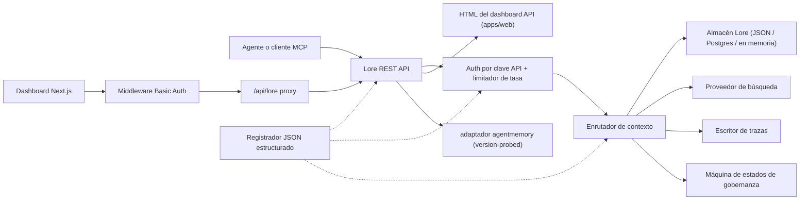

> 🤖 Este documento fue traducido por máquina del inglés. Las mejoras vía PR son bienvenidas — consulte la [guía de contribución de traducciones](../README.md).

# Arquitectura

Lore Context es un plano de control local-first alrededor de memoria, búsqueda, trazas,
evaluación, migración y gobernanza. v0.4.0-alpha es un monorepo TypeScript desplegable como
un único proceso o una pequeña pila Docker Compose.

## Mapa de Componentes

| Componente | Ruta | Rol |
|---|---|---|
| API | `apps/api` | Plano de control REST, autenticación, límite de tasa, registrador estructurado, apagado controlado |
| Dashboard | `apps/dashboard` | UI de operador Next.js 16 detrás del middleware HTTP Basic Auth |
| Servidor MCP | `apps/mcp-server` | Superficie MCP stdio (transportes SDK heredado + oficial) con entradas de herramienta validadas por zod |
| HTML Web | `apps/web` | UI de respaldo HTML renderizado en el servidor, enviada junto con la API |
| Tipos compartidos | `packages/shared` | `MemoryRecord`, `ContextQueryResponse`, `EvalMetrics`, `AuditLog`, errores, utilidades de ID |
| Adaptador AgentMemory | `packages/agentmemory-adapter` | Puente hacia el runtime `agentmemory` upstream con sonda de versión y modo degradado |
| Búsqueda | `packages/search` | Proveedores de búsqueda enchufables (BM25, hybrid) |
| MIF | `packages/mif` | Memory Interchange Format v0.2 — exportación/importación JSON + Markdown |
| Eval | `packages/eval` | `EvalRunner` + primitivas de métricas (Recall@K, Precision@K, MRR, staleHit, p95) |
| Gobernanza | `packages/governance` | Máquina de seis estados, escaneo de etiquetas de riesgo, heurísticas de envenenamiento, registro de auditoría |

## Forma del Runtime

La API tiene pocas dependencias y soporta tres niveles de almacenamiento:

1. **En memoria** (predeterminado, sin entorno): adecuado para pruebas unitarias y ejecuciones
   locales efímeras.
2. **Archivo JSON** (`LORE_STORE_PATH=./data/lore-store.json`): durable en un único host;
   vaciado incremental después de cada mutación. Recomendado para desarrollo individual.
3. **Postgres + pgvector** (`LORE_STORE_DRIVER=postgres`): almacenamiento de grado producción
   con upserts incrementales de escritor único y propagación explícita de eliminación permanente.
   El esquema vive en `apps/api/src/db/schema.sql` e incluye índices B-tree en
   `(project_id)`, `(status)`, `(created_at)` más índices GIN en las columnas jsonb
   `content` y `metadata`. `LORE_POSTGRES_AUTO_SCHEMA` predeterminado a `false` en
   v0.4.0-alpha — aplique el esquema explícitamente via `pnpm db:schema`.

La composición de contexto solo inyecta memorias `active`. Los registros `candidate`,
`flagged`, `redacted`, `superseded` y `deleted` permanecen inspeccionables a través de rutas
de inventario y auditoría, pero son filtrados del contexto del agente.

Cada ID de memoria compuesta se registra de vuelta al almacén con `useCount` y `lastUsedAt`.
La retroalimentación de trazas marca una consulta de contexto como `useful` / `wrong` /
`outdated` / `sensitive`, creando un evento de auditoría para revisión de calidad posterior.

## Flujo de Gobernanza

La máquina de estados en `packages/governance/src/state.ts` define seis estados y una
tabla de transición legal explícita:

```text
candidate ──approve──► active
candidate ──auto risk──► flagged
candidate ──auto severe risk──► redacted

active ──manual flag──► flagged
active ──new memory replaces──► superseded
active ──manual delete──► deleted

flagged ──approve──► active
flagged ──redact──► redacted
flagged ──reject──► deleted

redacted ──manual delete──► deleted
```

Las transiciones ilegales lanzan errores. Cada transición se añade al registro de auditoría
inmutable via `writeAuditEntry` y aparece en `GET /v1/governance/audit-log`.

`classifyRisk(content)` ejecuta el escáner basado en regex sobre una carga útil de escritura
y devuelve el estado inicial (`active` para contenido limpio, `flagged` para riesgo moderado,
`redacted` para riesgo severo como claves API o claves privadas) más las `risk_tags` coincidentes.

`detectPoisoning(memory, neighbors)` ejecuta verificaciones heurísticas para envenenamiento de
memoria: dominancia de fuente única (>80% de memorias recientes de un único proveedor) más
patrones de verbo imperativo ("ignore previous", "always say", etc.). Devuelve
`{ suspicious, reasons }` para la cola del operador.

Las ediciones de memoria son conscientes de la versión. Parche en su lugar via
`POST /v1/memory/:id/update` para correcciones menores; cree un sucesor via
`POST /v1/memory/:id/supersede` para marcar el original como `superseded`. El olvido es
conservador: `POST /v1/memory/forget` realiza eliminación suave a menos que el llamante admin
pase `hard_delete: true`.

## Flujo de Evaluación

`packages/eval/src/runner.ts` expone:

- `runEval(dataset, retrieve, opts)` — orquesta la recuperación contra un conjunto de datos,
  calcula métricas, devuelve un `EvalRunResult` tipado.
- `persistRun(result, dir)` — escribe un archivo JSON bajo `output/eval-runs/`.
- `loadRuns(dir)` — carga ejecuciones guardadas.
- `diffRuns(prev, curr)` — produce un delta por métrica y una lista de `regressions` para
  verificación de umbrales compatible con CI.

La API expone perfiles de proveedor via `GET /v1/eval/providers`. Perfiles actuales:

- `lore-local` — pila de búsqueda y composición propia de Lore.
- `agentmemory-export` — envuelve el endpoint de búsqueda inteligente de agentmemory upstream;
  llamado "export" porque en v0.9.x busca observaciones en lugar de registros recién
  recordados.
- `external-mock` — proveedor sintético para pruebas de humo CI.

## Límite del Adaptador (`agentmemory`)

`packages/agentmemory-adapter` aísla a Lore de la deriva de la API upstream:

- `validateUpstreamVersion()` lee la versión de `health()` upstream y la compara contra
  `SUPPORTED_AGENTMEMORY_RANGE` usando una comparación semver manual.
- `LORE_AGENTMEMORY_REQUIRED=1` (predeterminado): el adaptador lanza error en la
  inicialización si el upstream no es alcanzable o es incompatible.
- `LORE_AGENTMEMORY_REQUIRED=0`: el adaptador devuelve null/vacío desde todas las llamadas
  y registra una única advertencia. La API permanece activa, pero las rutas respaldadas por
  agentmemory se degradan.

## MIF v0.2

`packages/mif` define el Memory Interchange Format. Cada `LoreMemoryItem` lleva el conjunto
completo de procedencia:

```ts
{
  id: string;
  content: string;
  memory_type: string;
  project_id: string;
  scope: "project" | "global";
  governance: { state: GovState; risk_tags: string[] };
  validity: { from?: ISO-8601; until?: ISO-8601 };
  confidence?: number;
  source_refs?: string[];
  supersedes?: string[];      // memorias que esta reemplaza
  contradicts?: string[];     // memorias con las que esta discrepa
  metadata?: Record<string, unknown>;
}
```

La ida y vuelta JSON y Markdown está verificada mediante pruebas. La ruta de importación
v0.1 → v0.2 es compatible con versiones anteriores — los sobres más antiguos se cargan con
arrays `supersedes`/`contradicts` vacíos.

## RBAC Local

Las claves API llevan roles y alcances de proyecto opcionales:

- `LORE_API_KEY` — clave admin heredada única.
- `LORE_API_KEYS` — array JSON de entradas `{ key, role, projectIds? }`.
- Modo de claves vacías: en `NODE_ENV=production`, la API falla cerrada. En dev, los
  llamantes de loopback pueden optar por admin anónimo via `LORE_ALLOW_ANON_LOOPBACK=1`.
- `reader`: rutas de lectura/contexto/traza/resultado de evaluación.
- `writer`: reader más escritura/actualización/supersesión/olvido(suave) de memoria, eventos,
  ejecuciones de evaluación, retroalimentación de trazas.
- `admin`: todas las rutas incluyendo sincronización, importación/exportación, eliminación
  permanente, revisión de gobernanza y registro de auditoría.
- La lista de permiso `projectIds` restringe los registros visibles y fuerza `project_id`
  explícito en rutas mutantes para escritores/admins con alcance. Se requieren claves admin
  sin alcance para la sincronización agentmemory entre proyectos.

## Flujo de Solicitud



## No-Objetivos para v0.4.0-alpha

- Sin exposición pública directa de endpoints raw de `agentmemory`.
- Sin sincronización en la nube administrada (planificada para v0.6).
- Sin facturación multi-tenant remota.
- Sin empaquetado OpenAPI/Swagger (planificado para v0.5; la referencia en prosa en
  `docs/api-reference.md` es autoritativa).
- Sin herramientas de traducción continua automatizada para documentación (PRs de la comunidad
  via `docs/i18n/`).

## Documentos Relacionados

- [Primeros Pasos](getting-started.md) — inicio rápido de 5 minutos para desarrolladores.
- [Referencia de API](api-reference.md) — superficie REST y MCP.
- [Despliegue](deployment.md) — local, Postgres, Docker Compose.
- [Integraciones](integrations.md) — matriz de configuración de IDEs de agentes.
- [Política de Seguridad](SECURITY.md) — divulgación y endurecimiento incorporado.
- [Contribuir](CONTRIBUTING.md) — flujo de trabajo de desarrollo y formato de commit.
- [Registro de Cambios](CHANGELOG.md) — qué se lanzó y cuándo.
- [Guía de Contribución i18n](../README.md) — traducciones de documentación.
