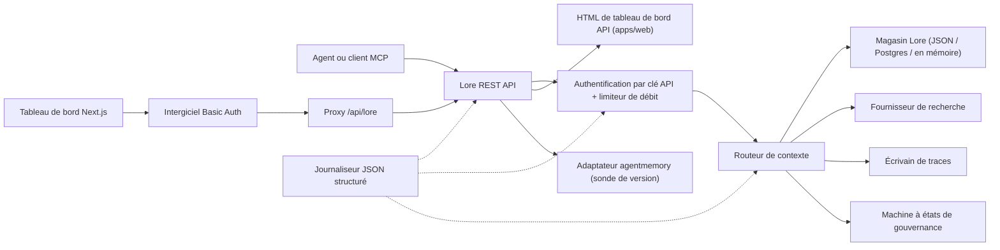

> 🤖 Ce document a été traduit automatiquement de l'anglais. Les améliorations via PR sont les bienvenues — consultez le [guide de contribution aux traductions](../README.md).

# Architecture

Lore Context est un plan de contrôle local-first autour de la mémoire, la recherche, les traces, l'évaluation,
la migration et la gouvernance. v0.4.0-alpha est un monorepo TypeScript déployable en tant que processus unique
ou petite pile Docker Compose.

## Carte des composants

| Composant | Chemin | Rôle |
|---|---|---|
| API | `apps/api` | Plan de contrôle REST, authentification, limitation de débit, journaliseur structuré, arrêt en douceur |
| Tableau de bord | `apps/dashboard` | Interface opérateur Next.js 16 derrière un intergiciel HTTP Basic Auth |
| Serveur MCP | `apps/mcp-server` | Surface MCP stdio (transports legacy + SDK officiel) avec entrées d'outils validées par zod |
| Web HTML | `apps/web` | Interface HTML de secours rendue côté serveur livrée avec l'API |
| Types partagés | `packages/shared` | `MemoryRecord`, `ContextQueryResponse`, `EvalMetrics`, `AuditLog`, erreurs, utilitaires ID |
| Adaptateur AgentMemory | `packages/agentmemory-adapter` | Passerelle vers l'environnement d'exécution `agentmemory` amont avec sonde de version et mode dégradé |
| Recherche | `packages/search` | Fournisseurs de recherche modulaires (BM25, hybrid) |
| MIF | `packages/mif` | Memory Interchange Format v0.2 — export/import JSON + Markdown |
| Eval | `packages/eval` | `EvalRunner` + primitives de métriques (Recall@K, Precision@K, MRR, staleHit, p95) |
| Gouvernance | `packages/governance` | Machine à états à six états, analyse des balises de risque, heuristiques d'empoisonnement, journal d'audit |

## Forme d'exécution

L'API est légère en dépendances et prend en charge trois niveaux de stockage :

1. **En mémoire** (par défaut, sans env) : adapté aux tests unitaires et aux exécutions locales éphémères.
2. **Fichier JSON** (`LORE_STORE_PATH=./data/lore-store.json`) : durable sur un seul hôte ;
   vidage incrémentiel après chaque mutation. Recommandé pour le développement solo.
3. **Postgres + pgvector** (`LORE_STORE_DRIVER=postgres`) : stockage de qualité production
   avec upserts incrémentiels à écriture unique et propagation de suppression définitive explicite.
   Le schéma réside dans `apps/api/src/db/schema.sql` et inclut des index B-tree sur
   `(project_id)`, `(status)`, `(created_at)` plus des index GIN sur les colonnes jsonb
   `content` et `metadata`. `LORE_POSTGRES_AUTO_SCHEMA` est par défaut à `false`
   dans v0.4.0-alpha — appliquez le schéma explicitement via `pnpm db:schema`.

La composition de contexte injecte uniquement les mémoires `active`. Les enregistrements `candidate`, `flagged`,
`redacted`, `superseded` et `deleted` restent inspectables via les chemins d'inventaire
et d'audit mais sont filtrés du contexte des agents.

Chaque identifiant de mémoire composée est enregistré dans le magasin avec `useCount` et
`lastUsedAt`. Le retour sur les traces marque une requête de contexte `useful` / `wrong` / `outdated` /
`sensitive`, créant un événement d'audit pour une révision ultérieure de la qualité.

## Flux de gouvernance

La machine à états dans `packages/governance/src/state.ts` définit six états et une
table de transition légale explicite :

```text
candidate ──approve──► active
candidate ──auto risk──► flagged
candidate ──auto severe risk──► redacted

active ──manual flag──► flagged
active ──new memory replaces──► superseded
active ──manual delete──► deleted

flagged ──approve──► active
flagged ──redact──► redacted
flagged ──reject──► deleted

redacted ──manual delete──► deleted
```

Les transitions illégales lèvent une erreur. Chaque transition est ajoutée au journal d'audit immuable
via `writeAuditEntry` et est accessible dans `GET /v1/governance/audit-log`.

`classifyRisk(content)` exécute l'analyseur basé sur des expressions régulières sur une charge utile d'écriture et retourne
l'état initial (`active` pour un contenu propre, `flagged` pour un risque modéré, `redacted`
pour un risque sévère comme les clés API ou les clés privées) plus les `risk_tags` correspondants.

`detectPoisoning(memory, neighbors)` exécute des vérifications heuristiques pour l'empoisonnement de mémoire :
dominance de source unique (>80 % des mémoires récentes provenant d'un seul fournisseur) plus
les motifs de verbes impératifs (« ignore previous », « always say », etc.). Retourne
`{ suspicious, reasons }` pour la file de l'opérateur.

Les modifications de mémoire sont sensibles à la version. Patch en place via `POST /v1/memory/:id/update` pour
de petites corrections ; créez un successeur via `POST /v1/memory/:id/supersede` pour marquer l'original
`superseded`. L'oubli est conservateur : `POST /v1/memory/forget`
effectue une suppression douce sauf si l'appelant admin passe `hard_delete: true`.

## Flux d'évaluation

`packages/eval/src/runner.ts` expose :

- `runEval(dataset, retrieve, opts)` — orchestre la récupération contre un jeu de données,
  calcule les métriques, retourne un `EvalRunResult` typé.
- `persistRun(result, dir)` — écrit un fichier JSON dans `output/eval-runs/`.
- `loadRuns(dir)` — charge les exécutions sauvegardées.
- `diffRuns(prev, curr)` — produit un delta par métrique et une liste `regressions` pour
  la vérification de seuil compatible CI.

L'API expose les profils de fournisseurs via `GET /v1/eval/providers`. Profils actuels :

- `lore-local` — propre pile de recherche et de composition de Lore.
- `agentmemory-export` — enveloppe le point d'accès smart-search d'agentmemory amont ;
  nommé « export » car dans v0.9.x il recherche les observations plutôt que les
  enregistrements de mémoire fraîchement mémorisés.
- `external-mock` — fournisseur synthétique pour les tests de fumée CI.

## Limite de l'adaptateur (`agentmemory`)

`packages/agentmemory-adapter` isole Lore des dérives d'API amont :

- `validateUpstreamVersion()` lit la version `health()` amont et compare contre
  `SUPPORTED_AGENTMEMORY_RANGE` en utilisant une comparaison semver manuelle.
- `LORE_AGENTMEMORY_REQUIRED=1` (par défaut) : l'adaptateur lève une erreur à l'initialisation si l'amont est
  inaccessible ou incompatible.
- `LORE_AGENTMEMORY_REQUIRED=0` : l'adaptateur retourne null/vide de tous les appels et
  journalise un seul avertissement. L'API reste active, mais les routes soutenues par agentmemory se dégradent.

## MIF v0.2

`packages/mif` définit le Memory Interchange Format. Chaque `LoreMemoryItem` porte
l'ensemble complet de provenance :

```ts
{
  id: string;
  content: string;
  memory_type: string;
  project_id: string;
  scope: "project" | "global";
  governance: { state: GovState; risk_tags: string[] };
  validity: { from?: ISO-8601; until?: ISO-8601 };
  confidence?: number;
  source_refs?: string[];
  supersedes?: string[];      // mémoires que celle-ci remplace
  contradicts?: string[];     // mémoires avec lesquelles celle-ci est en désaccord
  metadata?: Record<string, unknown>;
}
```

L'aller-retour JSON et Markdown est vérifié via des tests. Le chemin d'import v0.1 → v0.2 est
rétrocompatible — les enveloppes plus anciennes se chargent avec des tableaux `supersedes`/`contradicts` vides.

## RBAC local

Les clés API portent des rôles et des portées de projet optionnelles :

- `LORE_API_KEY` — clé admin legacy unique.
- `LORE_API_KEYS` — tableau JSON d'entrées `{ key, role, projectIds? }`.
- Mode sans clé : dans `NODE_ENV=production`, l'API échoue. En développement, les
  appelants de bouclage peuvent opter pour un admin anonyme via `LORE_ALLOW_ANON_LOOPBACK=1`.
- `reader` : routes de lecture/contexte/trace/résultat-éval.
- `writer` : reader plus écriture/mise à jour/succession/oubli(doux) de mémoire, événements, exécutions d'éval,
  retour de trace.
- `admin` : toutes les routes incluant synchronisation, import/export, suppression définitive, révision de gouvernance,
  et journal d'audit.
- La liste d'autorisation `projectIds` restreint les enregistrements visibles et force un `project_id` explicite
  sur les routes mutantes pour les writers/admins à portée limitée. Les clés admin non limitées sont requises pour
  la synchronisation agentmemory inter-projets.

## Flux de requête



## Non-objectifs pour v0.4.0-alpha

- Pas d'exposition publique directe des points d'accès `agentmemory` bruts.
- Pas de synchronisation cloud gérée (prévue pour v0.6).
- Pas de facturation multi-locataires à distance.
- Pas de packaging OpenAPI/Swagger (prévu pour v0.5 ; la référence en prose dans
  `docs/api-reference.md` fait autorité).
- Pas d'outillage de traduction continue automatisée pour la documentation (PR communautaires
  via `docs/i18n/`).

## Documents connexes

- [Démarrage rapide](getting-started.md) — démarrage développeur en 5 minutes.
- [Référence API](api-reference.md) — surface REST et MCP.
- [Déploiement](deployment.md) — local, Postgres, Docker Compose.
- [Intégrations](integrations.md) — matrice de configuration agent-IDE.
- [Politique de sécurité](SECURITY.md) — divulgation et renforcement intégré.
- [Contribuer](CONTRIBUTING.md) — workflow de développement et format de commit.
- [Changelog](CHANGELOG.md) — ce qui a été livré et quand.
- [Guide de contribution i18n](../README.md) — traductions de documentation.
