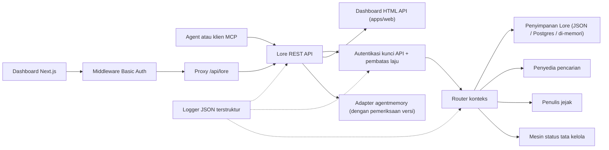

> 🤖 Dokumen ini diterjemahkan secara otomatis dari bahasa Inggris. Perbaikan melalui PR sangat diterima — lihat [panduan kontribusi terjemahan](../README.md).

# Arsitektur

Lore Context adalah panel kontrol lokal-utama di sekitar memori, pencarian, jejak, evaluasi,
migrasi, dan tata kelola. v0.4.0-alpha adalah monorepo TypeScript yang dapat diterapkan sebagai proses tunggal
atau tumpukan Docker Compose kecil.

## Peta Komponen

| Komponen | Jalur | Peran |
|---|---|---|
| API | `apps/api` | Panel kontrol REST, autentikasi, batas laju, logger terstruktur, pematian terkendali |
| Dashboard | `apps/dashboard` | UI operator Next.js 16 di balik middleware HTTP Basic Auth |
| Server MCP | `apps/mcp-server` | Permukaan MCP stdio (transport legacy + SDK resmi) dengan masukan alat yang divalidasi zod |
| HTML Web | `apps/web` | UI fallback HTML yang dirender server yang dikirimkan bersama API |
| Tipe bersama | `packages/shared` | `MemoryRecord`, `ContextQueryResponse`, `EvalMetrics`, `AuditLog`, kesalahan, utilitas ID |
| Adapter AgentMemory | `packages/agentmemory-adapter` | Jembatan ke runtime `agentmemory` upstream dengan pemeriksaan versi dan mode terdegradasi |
| Pencarian | `packages/search` | Penyedia pencarian yang dapat dikonfigurasi (BM25, hybrid) |
| MIF | `packages/mif` | Memory Interchange Format v0.2 — ekspor/impor JSON + Markdown |
| Eval | `packages/eval` | `EvalRunner` + primitif metrik (Recall@K, Precision@K, MRR, staleHit, p95) |
| Tata Kelola | `packages/governance` | Mesin status enam tahap, pemindaian tag risiko, heuristik keracunan, log audit |

## Bentuk Runtime

API memiliki sedikit ketergantungan dan mendukung tiga tingkat penyimpanan:

1. **Di memori** (default, tanpa env): cocok untuk uji unit dan jalankan lokal sementara.
2. **File JSON** (`LORE_STORE_PATH=./data/lore-store.json`): tahan lama pada satu host;
   flush inkremental setelah setiap mutasi. Direkomendasikan untuk pengembangan solo.
3. **Postgres + pgvector** (`LORE_STORE_DRIVER=postgres`): penyimpanan kelas produksi
   dengan upsert inkremental penulis tunggal dan propagasi penghapusan keras eksplisit.
   Skema berada di `apps/api/src/db/schema.sql` dan dikirimkan dengan indeks B-tree pada
   `(project_id)`, `(status)`, `(created_at)` ditambah indeks GIN pada kolom jsonb
   `content` dan `metadata`. `LORE_POSTGRES_AUTO_SCHEMA` default ke `false`
   di v0.4.0-alpha — terapkan skema secara eksplisit melalui `pnpm db:schema`.

Komposisi konteks hanya menyuntikkan memori `active`. Rekaman `candidate`, `flagged`,
`redacted`, `superseded`, dan `deleted` tetap dapat diperiksa melalui jalur inventaris
dan audit tetapi disaring dari konteks agen.

Setiap ID memori yang disusun dicatat kembali ke penyimpanan dengan `useCount` dan
`lastUsedAt`. Umpan balik jejak menandai kueri konteks sebagai `useful` / `wrong` / `outdated` /
`sensitive`, membuat event audit untuk tinjauan kualitas selanjutnya.

## Alur Tata Kelola

Mesin status di `packages/governance/src/state.ts` mendefinisikan enam status dan
tabel transisi legal eksplisit:

```text
candidate ──approve──► active
candidate ──auto risk──► flagged
candidate ──auto severe risk──► redacted

active ──manual flag──► flagged
active ──new memory replaces──► superseded
active ──manual delete──► deleted

flagged ──approve──► active
flagged ──redact──► redacted
flagged ──reject──► deleted

redacted ──manual delete──► deleted
```

Transisi ilegal melempar pengecualian. Setiap transisi ditambahkan ke log audit yang tidak dapat diubah
melalui `writeAuditEntry` dan muncul di `GET /v1/governance/audit-log`.

`classifyRisk(content)` menjalankan pemindai berbasis regex pada muatan penulisan dan mengembalikan
status awal (`active` untuk konten bersih, `flagged` untuk risiko sedang, `redacted`
untuk risiko parah seperti kunci API atau kunci privat) ditambah `risk_tags` yang cocok.

`detectPoisoning(memory, neighbors)` menjalankan pemeriksaan heuristik untuk keracunan memori:
dominasi sumber yang sama (>80% memori terbaru dari satu penyedia) ditambah
pola kata kerja imperatif ("ignore previous", "always say", dll.). Mengembalikan
`{ suspicious, reasons }` untuk antrian operator.

Edit memori sadar versi. Patch di tempat melalui `POST /v1/memory/:id/update` untuk
koreksi kecil; buat penerus melalui `POST /v1/memory/:id/supersede` untuk menandai
yang asli sebagai `superseded`. Melupakan bersifat konservatif: `POST /v1/memory/forget`
menghapus secara lunak kecuali pemanggil admin melewati `hard_delete: true`.

## Alur Eval

`packages/eval/src/runner.ts` mengekspos:

- `runEval(dataset, retrieve, opts)` — mengorkestrasikan pengambilan terhadap dataset,
  menghitung metrik, mengembalikan `EvalRunResult` yang diketik.
- `persistRun(result, dir)` — menulis file JSON di bawah `output/eval-runs/`.
- `loadRuns(dir)` — memuat run yang tersimpan.
- `diffRuns(prev, curr)` — menghasilkan delta per-metrik dan daftar `regressions` untuk
  pemeriksaan ambang batas yang ramah CI.

API mengekspos profil penyedia melalui `GET /v1/eval/providers`. Profil saat ini:

- `lore-local` — tumpukan pencarian dan komposisi Lore sendiri.
- `agentmemory-export` — membungkus endpoint smart-search agentmemory upstream;
  dinamai "export" karena dalam v0.9.x ia mencari observasi, bukan rekaman memori yang baru diingat.
- `external-mock` — penyedia sintetis untuk pengujian asap CI.

## Batas Adapter (`agentmemory`)

`packages/agentmemory-adapter` mengisolasi Lore dari pergeseran API upstream:

- `validateUpstreamVersion()` membaca versi `health()` upstream dan membandingkan dengan
  `SUPPORTED_AGENTMEMORY_RANGE` menggunakan perbandingan semver buatan sendiri.
- `LORE_AGENTMEMORY_REQUIRED=1` (default): adapter melempar pada init jika upstream tidak
  dapat dijangkau atau tidak kompatibel.
- `LORE_AGENTMEMORY_REQUIRED=0`: adapter mengembalikan null/kosong dari semua panggilan dan
  mencatat satu peringatan. API tetap berjalan, tetapi rute yang didukung agentmemory terdegradasi.

## MIF v0.2

`packages/mif` mendefinisikan Memory Interchange Format. Setiap `LoreMemoryItem` membawa
set provenance lengkap:

```ts
{
  id: string;
  content: string;
  memory_type: string;
  project_id: string;
  scope: "project" | "global";
  governance: { state: GovState; risk_tags: string[] };
  validity: { from?: ISO-8601; until?: ISO-8601 };
  confidence?: number;
  source_refs?: string[];
  supersedes?: string[];      // memori yang digantikan oleh ini
  contradicts?: string[];     // memori yang bertentangan dengan ini
  metadata?: Record<string, unknown>;
}
```

Round-trip JSON dan Markdown diverifikasi melalui tes. Jalur impor v0.1 → v0.2
kompatibel ke belakang — envelope lama dimuat dengan array `supersedes`/`contradicts` kosong.

## RBAC Lokal

Kunci API membawa peran dan cakupan proyek opsional:

- `LORE_API_KEY` — kunci admin legacy tunggal.
- `LORE_API_KEYS` — array JSON entri `{ key, role, projectIds? }`.
- Mode kunci kosong: di `NODE_ENV=production`, API gagal tertutup. Dalam dev, pemanggil loopback
  dapat memilih admin anonim melalui `LORE_ALLOW_ANON_LOOPBACK=1`.
- `reader`: rute read/context/trace/eval-result.
- `writer`: reader ditambah penulisan/pembaruan/supersede/forget(lunak) memori, event, eval
  runs, umpan balik jejak.
- `admin`: semua rute termasuk sinkronisasi, impor/ekspor, penghapusan keras, tinjauan tata kelola,
  dan log audit.
- Daftar izin `projectIds` mempersempit rekaman yang terlihat dan memaksa `project_id` eksplisit
  pada rute yang bermutasi untuk penulis/admin scoped. Kunci admin yang tidak scoped diperlukan untuk
  sinkronisasi agentmemory lintas proyek.

## Alur Permintaan



## Non-Tujuan untuk v0.4.0-alpha

- Tidak ada paparan langsung endpoint `agentmemory` mentah secara publik.
- Tidak ada sinkronisasi cloud terkelola (direncanakan untuk v0.6).
- Tidak ada penagihan multi-penyewa jarak jauh.
- Tidak ada pengemasan OpenAPI/Swagger (direncanakan untuk v0.5; referensi prosa di
  `docs/api-reference.md` adalah otoritatif).
- Tidak ada tooling terjemahan-berkelanjutan otomatis untuk dokumentasi (PR komunitas
  melalui `docs/i18n/`).

## Dokumen Terkait

- [Memulai](getting-started.md) — panduan mulai cepat pengembang 5 menit.
- [Referensi API](api-reference.md) — permukaan REST dan MCP.
- [Penerapan](deployment.md) — lokal, Postgres, Docker Compose.
- [Integrasi](integrations.md) — matriks pengaturan agent-IDE.
- [Kebijakan Keamanan](../../../SECURITY.md) — pengungkapan dan pengerasan bawaan.
- [Berkontribusi](../../../CONTRIBUTING.md) — alur kerja pengembangan dan format commit.
- [Changelog](../../../CHANGELOG.md) — apa yang dikirimkan kapan.
- [Panduan Kontributor i18n](../README.md) — terjemahan dokumentasi.
