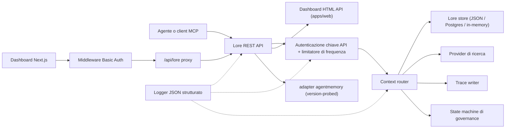

> 🤖 Questo documento è stato tradotto automaticamente dall'inglese. I miglioramenti tramite PR sono benvenuti — consulta la [guida ai contributi di traduzione](../README.md).

# Architettura

Lore Context è un piano di controllo local-first per memoria, ricerca, tracce, valutazione,
migrazione e governance. v0.4.0-alpha è un monorepo TypeScript distribuibile come processo singolo
o come piccolo stack Docker Compose.

## Mappa dei componenti

| Componente | Percorso | Ruolo |
|---|---|---|
| API | `apps/api` | Piano di controllo REST, autenticazione, limite di frequenza, logger strutturato, spegnimento controllato |
| Dashboard | `apps/dashboard` | UI operatore Next.js 16 dietro middleware HTTP Basic Auth |
| MCP Server | `apps/mcp-server` | Superficie MCP stdio (trasporti legacy + SDK ufficiale) con input degli strumenti validati con zod |
| Web HTML | `apps/web` | UI di fallback HTML renderizzata lato server distribuita con l'API |
| Tipi condivisi | `packages/shared` | `MemoryRecord`, `ContextQueryResponse`, `EvalMetrics`, `AuditLog`, errori, utilità ID |
| Adapter AgentMemory | `packages/agentmemory-adapter` | Bridge verso il runtime `agentmemory` upstream con probe di versione e modalità degradata |
| Search | `packages/search` | Provider di ricerca modulari (BM25, hybrid) |
| MIF | `packages/mif` | Memory Interchange Format v0.2 — export/import JSON + Markdown |
| Eval | `packages/eval` | `EvalRunner` + primitive metriche (Recall@K, Precision@K, MRR, staleHit, p95) |
| Governance | `packages/governance` | State machine a sei stati, scansione di tag di rischio, euristica di avvelenamento, audit log |

## Forma del runtime

L'API è leggera nelle dipendenze e supporta tre livelli di archiviazione:

1. **In-memory** (predefinito, nessun env): adatto per unit test ed esecuzioni locali effimere.
2. **File JSON** (`LORE_STORE_PATH=./data/lore-store.json`): durevole su un singolo host;
   flush incrementale dopo ogni mutazione. Consigliato per lo sviluppo individuale.
3. **Postgres + pgvector** (`LORE_STORE_DRIVER=postgres`): archiviazione di livello produzione
   con upsert incrementale a singolo writer e propagazione esplicita dell'hard-delete.
   Lo schema si trova in `apps/api/src/db/schema.sql` e include indici B-tree su
   `(project_id)`, `(status)`, `(created_at)` oltre agli indici GIN sulle colonne jsonb
   `content` e `metadata`. `LORE_POSTGRES_AUTO_SCHEMA` è `false` per impostazione predefinita
   in v0.4.0-alpha — applica lo schema esplicitamente tramite `pnpm db:schema`.

La composizione del contesto inietta solo le memorie `active`. I record `candidate`, `flagged`,
`redacted`, `superseded` e `deleted` rimangono ispezionabili attraverso i percorsi di inventario
e audit ma vengono filtrati dal contesto dell'agente.

Ogni ID di memoria composta viene registrato nello store con `useCount` e
`lastUsedAt`. Il feedback di traccia contrassegna una query di contesto come `useful` / `wrong` / `outdated` /
`sensitive`, creando un evento di audit per la revisione della qualità successiva.

## Flusso di governance

La state machine in `packages/governance/src/state.ts` definisce sei stati e una
tabella di transizione legale esplicita:

```text
candidate ──approve──► active
candidate ──auto risk──► flagged
candidate ──auto severe risk──► redacted

active ──manual flag──► flagged
active ──new memory replaces──► superseded
active ──manual delete──► deleted

flagged ──approve──► active
flagged ──redact──► redacted
flagged ──reject──► deleted

redacted ──manual delete──► deleted
```

Le transizioni illegali generano un'eccezione. Ogni transizione viene aggiunta all'audit log immutabile
tramite `writeAuditEntry` e viene esposta in `GET /v1/governance/audit-log`.

`classifyRisk(content)` esegue lo scanner basato su regex su un payload di scrittura e restituisce
lo stato iniziale (`active` per contenuto pulito, `flagged` per rischio moderato, `redacted`
per rischio grave come chiavi API o chiavi private) oltre ai `risk_tags` corrispondenti.

`detectPoisoning(memory, neighbors)` esegue controlli euristici per l'avvelenamento della memoria:
dominanza di stessa fonte (>80% delle memorie recenti da un singolo provider) più
pattern con verbi imperativi ("ignore previous", "always say", ecc.). Restituisce
`{ suspicious, reasons }` per la coda dell'operatore.

Le modifiche alla memoria sono consapevoli della versione. Patch in place tramite `POST /v1/memory/:id/update` per
piccole correzioni; crea un successore tramite `POST /v1/memory/:id/supersede` per contrassegnare
l'originale come `superseded`. La dimenticanza è conservativa: `POST /v1/memory/forget`
fa soft-delete a meno che il chiamante admin non passi `hard_delete: true`.

## Flusso di eval

`packages/eval/src/runner.ts` espone:

- `runEval(dataset, retrieve, opts)` — orchestra il recupero su un dataset,
  calcola le metriche, restituisce un `EvalRunResult` tipizzato.
- `persistRun(result, dir)` — scrive un file JSON sotto `output/eval-runs/`.
- `loadRuns(dir)` — carica le esecuzioni salvate.
- `diffRuns(prev, curr)` — produce un delta per metrica e un elenco `regressions` per
  il controllo delle soglie compatibile con CI.

L'API espone profili provider tramite `GET /v1/eval/providers`. Profili attuali:

- `lore-local` — stack di ricerca e composizione proprio di Lore.
- `agentmemory-export` — avvolge l'endpoint smart-search di agentmemory upstream;
  chiamato "export" perché in v0.9.x cerca le osservazioni piuttosto che i record
  di memoria freschi.
- `external-mock` — provider sintetico per lo smoke testing CI.

## Confine dell'adapter (`agentmemory`)

`packages/agentmemory-adapter` isola Lore dalla deriva delle API upstream:

- `validateUpstreamVersion()` legge la versione di `health()` upstream e la confronta con
  `SUPPORTED_AGENTMEMORY_RANGE` usando un confronto semver hand-rolled.
- `LORE_AGENTMEMORY_REQUIRED=1` (predefinito): l'adapter genera un'eccezione all'inizializzazione se l'upstream è
  irraggiungibile o incompatibile.
- `LORE_AGENTMEMORY_REQUIRED=0`: l'adapter restituisce null/empty da tutte le chiamate e
  registra un singolo avviso. L'API rimane attiva, ma le route supportate da agentmemory degradano.

## MIF v0.2

`packages/mif` definisce il Memory Interchange Format. Ogni `LoreMemoryItem` porta
il set completo di provenienza:

```ts
{
  id: string;
  content: string;
  memory_type: string;
  project_id: string;
  scope: "project" | "global";
  governance: { state: GovState; risk_tags: string[] };
  validity: { from?: ISO-8601; until?: ISO-8601 };
  confidence?: number;
  source_refs?: string[];
  supersedes?: string[];      // memorie che questa sostituisce
  contradicts?: string[];     // memorie con cui questa è in disaccordo
  metadata?: Record<string, unknown>;
}
```

Il round-trip JSON e Markdown è verificato tramite test. Il percorso di import v0.1 → v0.2 è
retrocompatibile — le envelope più vecchie vengono caricate con array `supersedes`/`contradicts` vuoti.

## RBAC locale

Le chiavi API portano ruoli e scope di progetto opzionali:

- `LORE_API_KEY` — singola chiave admin legacy.
- `LORE_API_KEYS` — array JSON di voci `{ key, role, projectIds? }`.
- Modalità chiavi vuote: in `NODE_ENV=production`, l'API fallisce in modo chiuso. In sviluppo, i
  chiamanti loopback possono optare per l'admin anonimo tramite `LORE_ALLOW_ANON_LOOPBACK=1`.
- `reader`: route di lettura/contesto/traccia/risultati-eval.
- `writer`: reader più scrittura/aggiornamento/sostituzione/dimenticanza(soft) della memoria, eventi, esecuzioni eval,
  feedback di traccia.
- `admin`: tutte le route inclusi sync, import/export, hard delete, revisione governance,
  e audit log.
- La allow-list `projectIds` restringe i record visibili e forza `project_id` esplicito
  sulle route mutanti per writer/admin con scope. Le chiavi admin senza scope sono richieste per
  la sincronizzazione agentmemory cross-project.

## Flusso delle richieste



## Non-obiettivi per v0.4.0-alpha

- Nessuna esposizione pubblica diretta degli endpoint raw `agentmemory`.
- Nessuna sincronizzazione cloud gestita (pianificata per v0.6).
- Nessuna fatturazione multi-tenant remota.
- Nessun packaging OpenAPI/Swagger (pianificato per v0.5; il riferimento in prosa in
  `docs/api-reference.md` è autorevole).
- Nessuno strumento di traduzione continua automatizzata per la documentazione (PR della community
  tramite `docs/i18n/`).

## Documenti correlati

- [Guida introduttiva](getting-started.md) — quickstart per sviluppatori in 5 minuti.
- [Riferimento API](api-reference.md) — superficie REST e MCP.
- [Deployment](deployment.md) — locale, Postgres, Docker Compose.
- [Integrazioni](integrations.md) — matrice di configurazione agente-IDE.
- [Policy di sicurezza](SECURITY.md) — divulgazione e hardening integrato.
- [Contribuire](CONTRIBUTING.md) — flusso di lavoro di sviluppo e formato dei commit.
- [Changelog](CHANGELOG.md) — cosa è stato rilasciato e quando.
- [Guida ai contributi i18n](../README.md) — traduzioni della documentazione.
