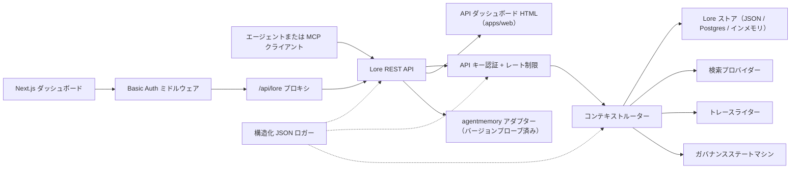

> 🤖 このドキュメントは英語版から機械翻訳されました。PR による改善を歓迎します — [翻訳貢献ガイド](../README.md)を参照してください。

# アーキテクチャ

Lore Context はメモリ、検索、トレース、評価、移行、ガバナンスを囲むローカルファーストのコントロールプレーンです。v0.4.0-alpha は単一プロセスまたは小さな Docker Compose スタックとしてデプロイ可能な TypeScript モノレポです。

## コンポーネントマップ

| コンポーネント | パス | 役割 |
|---|---|---|
| API | `apps/api` | REST コントロールプレーン、認証、レート制限、構造化ロガー、グレースフルシャットダウン |
| ダッシュボード | `apps/dashboard` | HTTP Basic Auth ミドルウェアの背後にある Next.js 16 オペレーター UI |
| MCP サーバー | `apps/mcp-server` | zod バリデート済みツール入力を持つ stdio MCP サーフェス（レガシー + 公式 SDK トランスポート） |
| Web HTML | `apps/web` | API と共に提供されるサーバーレンダリング HTML フォールバック UI |
| 共有型 | `packages/shared` | `MemoryRecord`、`ContextQueryResponse`、`EvalMetrics`、`AuditLog`、エラー、ID ユーティリティ |
| AgentMemory アダプター | `packages/agentmemory-adapter` | バージョンプローブと縮退モードを持つ上流 `agentmemory` ランタイムへのブリッジ |
| 検索 | `packages/search` | プラガブル検索プロバイダー（BM25、ハイブリッド） |
| MIF | `packages/mif` | Memory Interchange Format v0.2 — JSON + Markdown エクスポート/インポート |
| 評価 | `packages/eval` | `EvalRunner` + メトリクスプリミティブ（Recall@K、Precision@K、MRR、staleHit、p95） |
| ガバナンス | `packages/governance` | 6 状態ステートマシン、リスクタグスキャン、ポイズニングヒューリスティクス、監査ログ |

## ランタイム構成

API は依存関係が軽量で、3 つのストレージ層をサポートしています:

1. **インメモリ**（デフォルト、env なし）: ユニットテストと一時的なローカル実行に適しています。
2. **JSON ファイル**（`LORE_STORE_PATH=./data/lore-store.json`）: 単一ホストで耐久性あり。すべての変更後にインクリメンタルフラッシュ。個人開発に推奨。
3. **Postgres + pgvector**（`LORE_STORE_DRIVER=postgres`）: 単一ライターのインクリメンタルアップサートと明示的なハード削除伝播を持つ本番品質のストレージ。スキーマは `apps/api/src/db/schema.sql` にあり、`(project_id)`、`(status)`、`(created_at)` の B-tree インデックスと jsonb の `content` および `metadata` カラムの GIN インデックスが含まれています。`LORE_POSTGRES_AUTO_SCHEMA` は v0.4.0-alpha でデフォルト `false` です — `pnpm db:schema` を使用してスキーマを明示的に適用してください。

コンテキスト構成は `active` メモリのみを注入します。`candidate`、`flagged`、`redacted`、`superseded`、`deleted` レコードはインベントリと監査パスを通じて検査可能ですが、エージェントコンテキストからフィルタリングされます。

すべての構成されたメモリ ID は `useCount` と `lastUsedAt` と共にストアに書き戻されます。トレースフィードバックはコンテキストクエリを `useful` / `wrong` / `outdated` / `sensitive` としてマークし、後の品質レビューのための監査イベントを作成します。

## ガバナンスフロー

`packages/governance/src/state.ts` のステートマシンは 6 つの状態と明示的な合法遷移テーブルを定義しています:

```text
candidate ──approve──► active
candidate ──auto risk──► flagged
candidate ──auto severe risk──► redacted

active ──manual flag──► flagged
active ──new memory replaces──► superseded
active ──manual delete──► deleted

flagged ──approve──► active
flagged ──redact──► redacted
flagged ──reject──► deleted

redacted ──manual delete──► deleted
```

不正な遷移はスローします。すべての遷移は `writeAuditEntry` を通じて不変の監査ログに追記され、`GET /v1/governance/audit-log` に表示されます。

`classifyRisk(content)` は書き込みペイロードに対して正規表現ベースのスキャナーを実行し、初期状態（クリーンなコンテンツに対しては `active`、中程度のリスクには `flagged`、API キーや秘密鍵などの深刻なリスクには `redacted`）とマッチした `risk_tags` を返します。

`detectPoisoning(memory, neighbors)` はメモリポイズニングのヒューリスティックチェックを実行します: 同一ソース支配（最近のメモリの >80% が単一プロバイダーから）と命令動詞パターン（"ignore previous"、"always say" など）。オペレーターキューのために `{ suspicious, reasons }` を返します。

メモリ編集はバージョン対応です。小さな修正には `POST /v1/memory/:id/update` でインプレースパッチを使用します。元のものを `superseded` としてマークするために `POST /v1/memory/:id/supersede` で後継を作成します。忘却は保守的です: `POST /v1/memory/forget` はデフォルトでソフト削除しますが、admin 呼び出し元が `hard_delete: true` を渡す場合を除きます。

## 評価フロー

`packages/eval/src/runner.ts` が公開するもの:

- `runEval(dataset, retrieve, opts)` — データセットに対して検索を編成し、メトリクスを計算し、型付きの `EvalRunResult` を返します。
- `persistRun(result, dir)` — `output/eval-runs/` の下に JSON ファイルを書き込みます。
- `loadRuns(dir)` — 保存されたランを読み込みます。
- `diffRuns(prev, curr)` — メトリクスごとのデルタと CI フレンドリーなしきい値チェックのための `regressions` リストを生成します。

API は `GET /v1/eval/providers` を通じてプロバイダープロファイルを公開します。現在のプロファイル:

- `lore-local` — Lore 自身の検索と構成スタック。
- `agentmemory-export` — 上流 agentmemory のスマート検索エンドポイントをラップします。v0.9.x では新しく記憶されたレコードではなく観察を検索するため、"export" と名付けられています。
- `external-mock` — CI スモークテスト用の合成プロバイダー。

## アダプター境界（`agentmemory`）

`packages/agentmemory-adapter` は Lore を上流 API ドリフトから絶縁します:

- `validateUpstreamVersion()` は上流 `health()` バージョンを読み取り、手動ロール semver 比較を使用して `SUPPORTED_AGENTMEMORY_RANGE` と比較します。
- `LORE_AGENTMEMORY_REQUIRED=1`（デフォルト）: 上流が到達不能または非互換の場合、アダプターは初期化時にスローします。
- `LORE_AGENTMEMORY_REQUIRED=0`: アダプターはすべての呼び出しから null/空を返し、単一の警告をログします。API は動作し続けますが、agentmemory バックルートが縮退します。

## MIF v0.2

`packages/mif` は Memory Interchange Format を定義します。各 `LoreMemoryItem` は完全な出所セットを持ちます:

```ts
{
  id: string;
  content: string;
  memory_type: string;
  project_id: string;
  scope: "project" | "global";
  governance: { state: GovState; risk_tags: string[] };
  validity: { from?: ISO-8601; until?: ISO-8601 };
  confidence?: number;
  source_refs?: string[];
  supersedes?: string[];      // このメモリが置き換えるメモリ
  contradicts?: string[];     // このメモリが不同意するメモリ
  metadata?: Record<string, unknown>;
}
```

JSON と Markdown のラウンドトリップはテストで検証されています。v0.1 → v0.2 のインポートパスは後方互換です — 古いエンベロープは空の `supersedes`/`contradicts` 配列で読み込まれます。

## ローカル RBAC

API キーはロールとオプションのプロジェクトスコープを持ちます:

- `LORE_API_KEY` — 単一のレガシー admin キー。
- `LORE_API_KEYS` — `{ key, role, projectIds? }` エントリの JSON 配列。
- 空キーモード: `NODE_ENV=production` では API はフェイルクローズします。開発では、ループバック呼び出し元は `LORE_ALLOW_ANON_LOOPBACK=1` を使用して匿名 admin にオプトインできます。
- `reader`: 読み取り/コンテキスト/トレース/評価結果ルート。
- `writer`: reader に加えてメモリ書き込み/更新/継承/忘却（ソフト）、イベント、評価ラン、トレースフィードバック。
- `admin`: 同期、インポート/エクスポート、ハード削除、ガバナンスレビュー、監査ログを含むすべてのルート。
- `projectIds` 許可リストは可視レコードを絞り込み、スコープ付きライター/admin の変更ルートで明示的な `project_id` を強制します。クロスプロジェクトの agentmemory 同期にはスコープなしの admin キーが必要です。

## リクエストフロー



## v0.4.0-alpha の非目標

- 生の `agentmemory` エンドポイントの直接公開なし。
- マネージドクラウド同期なし（v0.6 で予定）。
- リモートマルチテナント課金なし。
- OpenAPI/Swagger パッケージングなし（v0.5 で予定。`docs/api-reference.md` の散文リファレンスが権威的）。
- ドキュメントの自動継続翻訳ツールなし（`docs/i18n/` を通じたコミュニティ PR）。

## 関連ドキュメント

- [はじめに](getting-started.md) — 5 分間の開発者クイックスタート。
- [API リファレンス](api-reference.md) — REST と MCP サーフェス。
- [デプロイ](deployment.md) — ローカル、Postgres、Docker Compose。
- [インテグレーション](integrations.md) — エージェント IDE セットアップマトリックス。
- [セキュリティポリシー](SECURITY.md) — 開示と組み込みハードニング。
- [貢献](CONTRIBUTING.md) — 開発ワークフローとコミットフォーマット。
- [変更履歴](CHANGELOG.md) — いつ何が出荷されたか。
- [i18n 貢献ガイド](../README.md) — ドキュメント翻訳。
