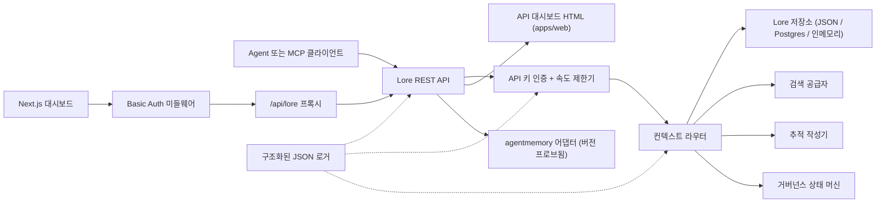

> 🤖 이 문서는 영어 원본에서 기계 번역되었습니다. PR을 통한 개선을 환영합니다 — [번역 기여 가이드](../README.md) 참조.

# 아키텍처

Lore Context는 메모리, 검색, 추적, 평가, 마이그레이션 및 거버넌스를 위한 로컬 우선 컨트롤 플레인입니다. v0.4.0-alpha는 단일 프로세스 또는 소규모 Docker Compose 스택으로 배포 가능한 TypeScript 모노레포입니다.

## 컴포넌트 맵

| 컴포넌트 | 경로 | 역할 |
|---|---|---|
| API | `apps/api` | REST 컨트롤 플레인, 인증, 속도 제한, 구조화된 로거, 정상 종료 |
| Dashboard | `apps/dashboard` | HTTP Basic Auth 미들웨어 뒤에 있는 Next.js 16 운영자 UI |
| MCP Server | `apps/mcp-server` | zod 유효성 검사 도구 입력이 있는 stdio MCP 표면(레거시 + 공식 SDK 전송) |
| Web HTML | `apps/web` | API와 함께 제공되는 서버 렌더링 HTML 폴백 UI |
| 공유 타입 | `packages/shared` | `MemoryRecord`, `ContextQueryResponse`, `EvalMetrics`, `AuditLog`, 오류, ID 유틸 |
| AgentMemory 어댑터 | `packages/agentmemory-adapter` | 버전 프로브 및 저하 모드가 있는 업스트림 `agentmemory` 런타임 브릿지 |
| Search | `packages/search` | 플러그 가능 검색 공급자(BM25, hybrid) |
| MIF | `packages/mif` | Memory Interchange Format v0.2 — JSON + Markdown 내보내기/가져오기 |
| Eval | `packages/eval` | `EvalRunner` + 메트릭 기본 요소(Recall@K, Precision@K, MRR, staleHit, p95) |
| Governance | `packages/governance` | 6단계 상태 머신, 위험 태그 스캐닝, 포이즈닝 휴리스틱, 감사 로그 |

## 런타임 형태

API는 의존성이 적고 세 가지 스토리지 계층을 지원합니다:

1. **인메모리** (기본값, 환경 변수 없음): 단위 테스트 및 임시 로컬 실행에 적합합니다.
2. **JSON 파일** (`LORE_STORE_PATH=./data/lore-store.json`): 단일 호스트에서 지속적. 모든 변경 후 증분 플러시. 솔로 개발에 권장됩니다.
3. **Postgres + pgvector** (`LORE_STORE_DRIVER=postgres`): 단일 쓰기 증분 업서트 및 명시적 하드 삭제 전파가 있는 프로덕션급 스토리지. 스키마는 `apps/api/src/db/schema.sql`에 있으며 `(project_id)`, `(status)`, `(created_at)`에 대한 B-tree 인덱스와 jsonb `content` 및 `metadata` 열의 GIN 인덱스를 포함합니다. `LORE_POSTGRES_AUTO_SCHEMA`는 v0.4.0-alpha에서 기본값이 `false`입니다 — `pnpm db:schema`를 통해 스키마를 명시적으로 적용하십시오.

컨텍스트 구성은 `active` 메모리만 주입합니다. `candidate`, `flagged`, `redacted`, `superseded` 및 `deleted` 레코드는 인벤토리 및 감사 경로를 통해 검사 가능하지만 에이전트 컨텍스트에서 필터링됩니다.

모든 구성된 메모리 id는 `useCount` 및 `lastUsedAt`과 함께 저장소에 다시 기록됩니다. 추적 피드백은 컨텍스트 쿼리를 `useful` / `wrong` / `outdated` / `sensitive`로 표시하여 나중에 품질 검토를 위한 감사 이벤트를 생성합니다.

## 거버넌스 흐름

`packages/governance/src/state.ts`의 상태 머신은 6개의 상태와 명시적 법적 전환 테이블을 정의합니다:

```text
candidate ──approve──► active
candidate ──auto risk──► flagged
candidate ──auto severe risk──► redacted

active ──manual flag──► flagged
active ──new memory replaces──► superseded
active ──manual delete──► deleted

flagged ──approve──► active
flagged ──redact──► redacted
flagged ──reject──► deleted

redacted ──manual delete──► deleted
```

불법적인 전환은 예외를 발생시킵니다. 모든 전환은 `writeAuditEntry`를 통해 변경 불가 감사 로그에 추가되고 `GET /v1/governance/audit-log`에 표시됩니다.

`classifyRisk(content)`는 쓰기 페이로드에 대해 정규식 기반 스캐너를 실행하고 초기 상태(깔끔한 콘텐츠의 경우 `active`, 중간 위험의 경우 `flagged`, API 키나 개인 키와 같은 심각한 위험의 경우 `redacted`) 및 일치하는 `risk_tags`를 반환합니다.

`detectPoisoning(memory, neighbors)`는 메모리 포이즈닝에 대한 휴리스틱 검사를 실행합니다: 동일 소스 지배(단일 공급자에서 최근 메모리의 >80%) 및 명령형 동사 패턴("ignore previous", "always say" 등). 운영자 큐를 위해 `{ suspicious, reasons }`를 반환합니다.

메모리 편집은 버전 인식입니다. 소소한 수정을 위해 `POST /v1/memory/:id/update`를 통해 인플레이스 패치. 원본을 `superseded`로 표시하기 위해 `POST /v1/memory/:id/supersede`를 통해 후계자를 생성합니다. 삭제는 보수적입니다: `POST /v1/memory/forget`은 관리자 호출자가 `hard_delete: true`를 전달하지 않는 한 소프트 삭제합니다.

## Eval 흐름

`packages/eval/src/runner.ts`가 노출하는 것:

- `runEval(dataset, retrieve, opts)` — 데이터셋에 대해 검색을 조율하고, 메트릭을 계산하고, 타입이 지정된 `EvalRunResult`를 반환합니다.
- `persistRun(result, dir)` — `output/eval-runs/` 아래에 JSON 파일을 씁니다.
- `loadRuns(dir)` — 저장된 실행을 로드합니다.
- `diffRuns(prev, curr)` — CI 친화적 임계값 확인을 위한 메트릭별 델타 및 `regressions` 목록을 생성합니다.

API는 `GET /v1/eval/providers`를 통해 공급자 프로파일을 노출합니다. 현재 프로파일:

- `lore-local` — Lore의 자체 검색 및 구성 스택.
- `agentmemory-export` — 업스트림 agentmemory 스마트 검색 엔드포인트를 래핑합니다. v0.9.x에서 새로 기억된 레코드보다 관찰을 검색하기 때문에 "export"라고 명명됩니다.
- `external-mock` — CI 스모크 테스트를 위한 합성 공급자.

## 어댑터 경계(`agentmemory`)

`packages/agentmemory-adapter`는 Lore를 업스트림 API 드리프트로부터 보호합니다:

- `validateUpstreamVersion()`은 업스트림 `health()` 버전을 읽고 수동 작성 semver 비교를 사용하여 `SUPPORTED_AGENTMEMORY_RANGE`와 비교합니다.
- `LORE_AGENTMEMORY_REQUIRED=1` (기본값): 업스트림에 접근할 수 없거나 비호환인 경우 어댑터는 초기화 시 예외를 발생시킵니다.
- `LORE_AGENTMEMORY_REQUIRED=0`: 어댑터는 모든 호출에서 null/빈 값을 반환하고 단일 경고를 로그합니다. API는 계속 작동하지만 agentmemory 기반 경로가 저하됩니다.

## MIF v0.2

`packages/mif`는 Memory Interchange Format을 정의합니다. 각 `LoreMemoryItem`은 전체 출처 세트를 포함합니다:

```ts
{
  id: string;
  content: string;
  memory_type: string;
  project_id: string;
  scope: "project" | "global";
  governance: { state: GovState; risk_tags: string[] };
  validity: { from?: ISO-8601; until?: ISO-8601 };
  confidence?: number;
  source_refs?: string[];
  supersedes?: string[];      // 이 메모리가 대체하는 메모리들
  contradicts?: string[];     // 이 메모리가 동의하지 않는 메모리들
  metadata?: Record<string, unknown>;
}
```

JSON 및 Markdown 라운드트립은 테스트를 통해 검증됩니다. v0.1 → v0.2 가져오기 경로는 하위 호환입니다 — 이전 봉투는 빈 `supersedes`/`contradicts` 배열로 로드됩니다.

## 로컬 RBAC

API 키는 역할과 선택적 프로젝트 범위를 가집니다:

- `LORE_API_KEY` — 단일 레거시 관리자 키.
- `LORE_API_KEYS` — `{ key, role, projectIds? }` 항목의 JSON 배열.
- 빈 키 모드: `NODE_ENV=production`에서 API는 실패 폐쇄 방식으로 동작합니다. 개발에서는 루프백 호출자가 `LORE_ALLOW_ANON_LOOPBACK=1`을 통해 익명 관리자를 선택할 수 있습니다.
- `reader`: 읽기/컨텍스트/추적/eval 결과 경로.
- `writer`: reader 플러스 메모리 쓰기/업데이트/교체/삭제(소프트), 이벤트, eval 실행, 추적 피드백.
- `admin`: 동기화, 가져오기/내보내기, 하드 삭제, 거버넌스 검토 및 감사 로그를 포함한 모든 경로.
- `projectIds` 허용 목록은 가시적 레코드를 좁히고 범위 지정된 writer/admin을 위한 변경 경로에서 명시적 `project_id`를 강제합니다. 크로스 프로젝트 agentmemory 동기화를 위해서는 범위 없는 관리자 키가 필요합니다.

## 요청 흐름



## v0.4.0-alpha의 비목표

- 원시 `agentmemory` 엔드포인트의 직접 공개 노출 없음.
- 관리형 클라우드 동기화 없음(v0.6에 계획됨).
- 원격 멀티테넌트 청구 없음.
- OpenAPI/Swagger 패키징 없음(v0.5에 계획됨. `docs/api-reference.md`의 산문 참조가 권위 있음).
- 문서를 위한 자동화된 지속 번역 도구 없음(커뮤니티 PR은 `docs/i18n/`을 통해).

## 관련 문서

- [시작하기](getting-started.md) — 5분 개발자 빠른 시작.
- [API 참조](api-reference.md) — REST 및 MCP 표면.
- [배포](deployment.md) — 로컬, Postgres, Docker Compose.
- [통합](integrations.md) — 에이전트 IDE 설정 매트릭스.
- [보안 정책](SECURITY.md) — 공개 및 내장 강화.
- [기여](CONTRIBUTING.md) — 개발 워크플로 및 커밋 형식.
- [변경 이력](CHANGELOG.md) — 언제 무엇이 출시되었는지.
- [i18n 기여자 가이드](../README.md) — 문서 번역.
