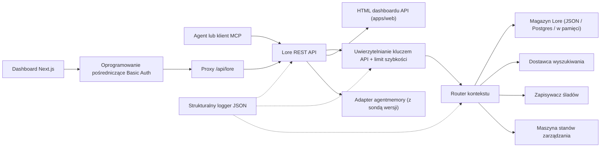

> 🤖 Ten dokument został przetłumaczony maszynowo z języka angielskiego. Ulepszenia poprzez PR są mile widziane — zobacz [przewodnik dla tłumaczy](../README.md).

# Architektura

Lore Context to płaszczyzna sterowania local-first wokół pamięci, wyszukiwania, śladów, ewaluacji,
migracji i zarządzania. v0.4.0-alpha to monorepo TypeScript wdrażalne jako pojedynczy
proces lub mały stos Docker Compose.

## Mapa komponentów

| Komponent | Ścieżka | Rola |
|---|---|---|
| API | `apps/api` | Płaszczyzna sterowania REST, uwierzytelnianie, limit szybkości, strukturalny logger, łagodne wyłączanie |
| Dashboard | `apps/dashboard` | Interfejs operatora Next.js 16 za oprogramowaniem pośredniczącym HTTP Basic Auth |
| Serwer MCP | `apps/mcp-server` | Powierzchnia MCP stdio (transporty legacy + oficjalny SDK) z walidowanymi przez zod wejściami narzędzi |
| HTML WWW | `apps/web` | Zastępczy interfejs HTML renderowany po stronie serwera dostarczany razem z API |
| Typy współdzielone | `packages/shared` | `MemoryRecord`, `ContextQueryResponse`, `EvalMetrics`, `AuditLog`, błędy, narzędzia ID |
| Adapter AgentMemory | `packages/agentmemory-adapter` | Most do środowiska uruchomieniowego `agentmemory` upstream z sondą wersji i trybem zdegradowanym |
| Search | `packages/search` | Wtykowe dostawcy wyszukiwania (BM25, hybrid) |
| MIF | `packages/mif` | Memory Interchange Format v0.2 — eksport/import JSON + Markdown |
| Eval | `packages/eval` | `EvalRunner` + prymitywy metryk (Recall@K, Precision@K, MRR, staleHit, p95) |
| Zarządzanie | `packages/governance` | Sześcioetapowa maszyna stanów, skanowanie znaczników ryzyka, heurystyki zatruwania, dziennik audytu |

## Kształt środowiska uruchomieniowego

API ma minimalne zależności i obsługuje trzy warstwy magazynowania:

1. **W pamięci** (domyślnie, bez env): odpowiedni dla testów jednostkowych i efemerycznych lokalnych uruchomień.
2. **Plik JSON** (`LORE_STORE_PATH=./data/lore-store.json`): trwały na jednym hoście;
   inkrementalne opróżnianie po każdej mutacji. Zalecany do solowego developmentu.
3. **Postgres + pgvector** (`LORE_STORE_DRIVER=postgres`): produkcyjne magazynowanie
   z inkrementalnymi upsertami jednego pisarza i jawną propagacją twardego usunięcia.
   Schemat znajduje się w `apps/api/src/db/schema.sql` i zawiera indeksy B-tree na
   `(project_id)`, `(status)`, `(created_at)` oraz indeksy GIN na kolumnach jsonb
   `content` i `metadata`. `LORE_POSTGRES_AUTO_SCHEMA` domyślnie `false`
   w v0.4.0-alpha — zastosuj schemat jawnie przez `pnpm db:schema`.

Kompozycja kontekstu wstrzykuje tylko pamięci `active`. Rekordy `candidate`, `flagged`,
`redacted`, `superseded` i `deleted` pozostają inspektowalne przez ścieżki inwentarza
i audytu, ale są odfiltrowane z kontekstu agenta.

Każde skomponowane id pamięci jest zapisywane z powrotem do magazynu z `useCount` i
`lastUsedAt`. Informacja zwrotna o śladach oznacza zapytanie kontekstowe jako `useful` / `wrong` / `outdated` /
`sensitive`, tworząc zdarzenie audytu do późniejszego przeglądu jakości.

## Przepływ zarządzania

Maszyna stanów w `packages/governance/src/state.ts` definiuje sześć stanów i
jawną tabelę legalnych przejść:

```text
candidate ──approve──► active
candidate ──auto risk──► flagged
candidate ──auto severe risk──► redacted

active ──manual flag──► flagged
active ──new memory replaces──► superseded
active ──manual delete──► deleted

flagged ──approve──► active
flagged ──redact──► redacted
flagged ──reject──► deleted

redacted ──manual delete──► deleted
```

Nielegalne przejścia zgłaszają wyjątek. Każde przejście jest dołączane do niezmiennego dziennika audytu
przez `writeAuditEntry` i widoczne w `GET /v1/governance/audit-log`.

`classifyRisk(content)` uruchamia skaner oparty na regex na ładunku zapisu i zwraca
stan początkowy (`active` dla czystej zawartości, `flagged` dla umiarkowanego ryzyka, `redacted`
dla poważnego ryzyka jak klucze API lub klucze prywatne) plus dopasowane `risk_tags`.

`detectPoisoning(memory, neighbors)` uruchamia sprawdzenia heurystyczne pod kątem zatruwania pamięci:
dominacja tego samego źródła (>80% ostatnich pamięci z jednego dostawcy) plus
wzorce czasowników rozkazujących ("ignore previous", "always say", itp.). Zwraca
`{ suspicious, reasons }` dla kolejki operatora.

Edycje pamięci są świadome wersji. Łataj w miejscu przez `POST /v1/memory/:id/update` dla
małych korekt; twórz następnika przez `POST /v1/memory/:id/supersede`, by oznaczyć
oryginał jako `superseded`. Zapominanie jest konserwatywne: `POST /v1/memory/forget`
wykonuje miękkie usunięcie, chyba że wywołujący admin przekaże `hard_delete: true`.

## Przepływ Eval

`packages/eval/src/runner.ts` udostępnia:

- `runEval(dataset, retrieve, opts)` — orkiestruje pobieranie względem zbioru danych,
  oblicza metryki, zwraca typowany `EvalRunResult`.
- `persistRun(result, dir)` — zapisuje plik JSON pod `output/eval-runs/`.
- `loadRuns(dir)` — ładuje zapisane przebiegi.
- `diffRuns(prev, curr)` — produkuje deltę per metrykę i listę `regressions` dla
  sprawdzania progów przyjaznego CI.

API udostępnia profile dostawców przez `GET /v1/eval/providers`. Bieżące profile:

- `lore-local` — własny stos wyszukiwania i kompozycji Lore.
- `agentmemory-export` — opakowuje punkt końcowy smart-search upstream agentmemory;
  nazwany "export", bo w v0.9.x przeszukuje obserwacje, a nie świeżo zapamiętane rekordy.
- `external-mock` — syntetyczny dostawca do smoke testów CI.

## Granica adaptera (`agentmemory`)

`packages/agentmemory-adapter` izoluje Lore przed dryfem API upstream:

- `validateUpstreamVersion()` odczytuje wersję `health()` upstream i porównuje z
  `SUPPORTED_AGENTMEMORY_RANGE` przy użyciu ręcznie napisanego porównania semver.
- `LORE_AGENTMEMORY_REQUIRED=1` (domyślnie): adapter zgłasza wyjątek przy inicjalizacji, jeśli upstream jest
  nieosiągalny lub niekompatybilny.
- `LORE_AGENTMEMORY_REQUIRED=0`: adapter zwraca null/puste ze wszystkich wywołań i
  loguje pojedyncze ostrzeżenie. API pozostaje aktywne, ale trasy wspierane przez agentmemory degradują.

## MIF v0.2

`packages/mif` definiuje Memory Interchange Format. Każdy `LoreMemoryItem` niesie
pełny zestaw proweniencji:

```ts
{
  id: string;
  content: string;
  memory_type: string;
  project_id: string;
  scope: "project" | "global";
  governance: { state: GovState; risk_tags: string[] };
  validity: { from?: ISO-8601; until?: ISO-8601 };
  confidence?: number;
  source_refs?: string[];
  supersedes?: string[];      // pamięci, które ten zastępuje
  contradicts?: string[];     // pamięci, z którymi ten jest niezgodny
  metadata?: Record<string, unknown>;
}
```

Round-trip JSON i Markdown jest weryfikowany przez testy. Ścieżka importu v0.1 → v0.2 jest
wstecznie kompatybilna — starsze koperty ładują się z pustymi tablicami `supersedes`/`contradicts`.

## Lokalny RBAC

Klucze API noszą role i opcjonalne zakresy projektów:

- `LORE_API_KEY` — pojedynczy starszy klucz admin.
- `LORE_API_KEYS` — tablica JSON wpisów `{ key, role, projectIds? }`.
- Tryb pustych kluczy: przy `NODE_ENV=production`, API zamyka się. W dev, wywołujący loopback
  mogą wybrać anonimowy admin przez `LORE_ALLOW_ANON_LOOPBACK=1`.
- `reader`: trasy read/context/trace/eval-result.
- `writer`: reader plus zapis/aktualizacja/zastąpienie/zapomnienie(miękkie) pamięci, zdarzenia, przebiegi eval,
  informacja zwrotna o śladach.
- `admin`: wszystkie trasy łącznie z synchronizacją, importem/eksportem, twardym usunięciem, przeglądem zarządzania
  i dziennikiem audytu.
- Lista zezwoleń `projectIds` zawęża widoczne rekordy i wymusza jawny `project_id`
  na trasach mutujących dla zakresowych pisarzy/adminów. Nieskopowane klucze admin są wymagane do
  synchronizacji agentmemory między projektami.

## Przepływ żądania



## Cele poza zakresem v0.4.0-alpha

- Brak bezpośredniego publicznego dostępu do surowych punktów końcowych `agentmemory`.
- Brak zarządzanej synchronizacji w chmurze (planowana dla v0.6).
- Brak zdalnego wielodostępnego rozliczania.
- Brak pakowania OpenAPI/Swagger (planowane dla v0.5; dokumentacja w prozie w
  `docs/api-reference.md` jest autorytatywna).
- Brak automatycznych narzędzi ciągłego tłumaczenia dokumentacji (PR społeczności
  przez `docs/i18n/`).

## Powiązane dokumenty

- [Pierwsze kroki](../getting-started.md) — 5-minutowy szybki start dla deweloperów.
- [Dokumentacja API](../api-reference.md) — powierzchnia REST i MCP.
- [Wdrożenie](../deployment.md) — lokalnie, Postgres, Docker Compose.
- [Integracje](../integrations.md) — macierz konfiguracji agent-IDE.
- [Polityka bezpieczeństwa](../SECURITY.md) — ujawnianie i wbudowane zabezpieczenia.
- [Współtworzenie](../CONTRIBUTING.md) — przepływ pracy deweloperskiej i format commita.
- [Changelog](../CHANGELOG.md) — co zostało dostarczone i kiedy.
- [Przewodnik dla tłumaczy i18n](../../i18n/README.md) — tłumaczenia dokumentacji.
