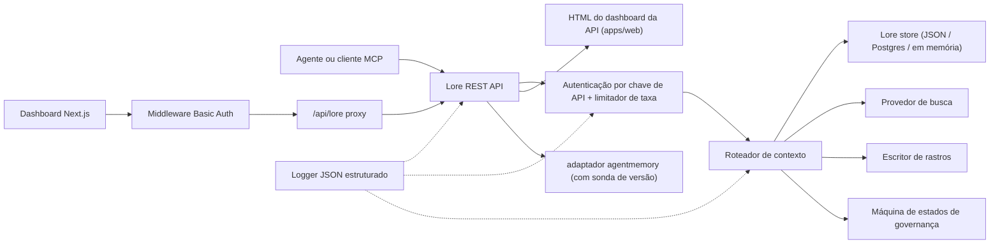

> 🤖 Este documento foi traduzido por máquina do inglês. Melhorias via PR são bem-vindas — consulte o [guia de contribuição de tradução](../README.md).

# Arquitetura

O Lore Context é um plano de controle local-first em torno de memória, busca, rastros,
avaliação, migração e governança. O v0.4.0-alpha é um monorepo TypeScript implantável
como um único processo ou uma pequena stack Docker Compose.

## Mapa de Componentes

| Componente | Caminho | Papel |
|---|---|---|
| API | `apps/api` | Plano de controle REST, autenticação, limite de taxa, logger estruturado, encerramento controlado |
| Dashboard | `apps/dashboard` | UI do operador Next.js 16 protegida por middleware HTTP Basic Auth |
| Servidor MCP | `apps/mcp-server` | Superfície MCP stdio (transportes legado + SDK oficial) com entradas de ferramentas validadas por zod |
| HTML Web | `apps/web` | UI HTML renderizada no servidor, entregue junto com a API |
| Tipos compartilhados | `packages/shared` | `MemoryRecord`, `ContextQueryResponse`, `EvalMetrics`, `AuditLog`, erros, utilitários de ID |
| Adaptador AgentMemory | `packages/agentmemory-adapter` | Bridge para o runtime `agentmemory` upstream com sonda de versão e modo degradado |
| Busca | `packages/search` | Provedores de busca plugáveis (BM25, híbrido) |
| MIF | `packages/mif` | Memory Interchange Format v0.2 — exportação/importação JSON + Markdown |
| Eval | `packages/eval` | `EvalRunner` + primitivas de métricas (Recall@K, Precision@K, MRR, staleHit, p95) |
| Governança | `packages/governance` | Máquina de seis estados, varredura de tags de risco, heurísticas de envenenamento, log de auditoria |

## Formato de Runtime

A API tem poucas dependências e suporta três camadas de armazenamento:

1. **Em memória** (padrão, sem variável de ambiente): adequado para testes unitários e
   execuções locais efêmeras.
2. **Arquivo JSON** (`LORE_STORE_PATH=./data/lore-store.json`): durável em um único host;
   flush incremental após cada mutação. Recomendado para desenvolvimento solo.
3. **Postgres + pgvector** (`LORE_STORE_DRIVER=postgres`): armazenamento em nível de
   produção com upserts incrementais de escritor único e propagação explícita de exclusão
   permanente. O schema fica em `apps/api/src/db/schema.sql` e inclui índices B-tree em
   `(project_id)`, `(status)`, `(created_at)` mais índices GIN nas colunas jsonb
   `content` e `metadata`. `LORE_POSTGRES_AUTO_SCHEMA` tem padrão `false` no
   v0.4.0-alpha — aplique o schema explicitamente via `pnpm db:schema`.

A composição de contexto injeta apenas memórias `active`. Registros `candidate`,
`flagged`, `redacted`, `superseded` e `deleted` permanecem inspecionáveis por caminhos
de inventário e auditoria, mas são filtrados do contexto do agente.

Cada id de memória composta é registrado de volta ao armazenamento com `useCount` e
`lastUsedAt`. O feedback de rastro marca uma consulta de contexto como `useful` /
`wrong` / `outdated` / `sensitive`, criando um evento de auditoria para revisão de
qualidade posterior.

## Fluxo de Governança

A máquina de estados em `packages/governance/src/state.ts` define seis estados e uma
tabela de transição legal explícita:

```text
candidate ──approve──► active
candidate ──auto risk──► flagged
candidate ──auto severe risk──► redacted

active ──manual flag──► flagged
active ──new memory replaces──► superseded
active ──manual delete──► deleted

flagged ──approve──► active
flagged ──redact──► redacted
flagged ──reject──► deleted

redacted ──manual delete──► deleted
```

Transições ilegais lançam exceção. Cada transição é adicionada ao log de auditoria
imutável via `writeAuditEntry` e aparece em `GET /v1/governance/audit-log`.

`classifyRisk(content)` executa o scanner baseado em regex sobre um payload de escrita
e retorna o estado inicial (`active` para conteúdo limpo, `flagged` para risco moderado,
`redacted` para risco severo como chaves de API ou chaves privadas) mais as `risk_tags`
correspondentes.

`detectPoisoning(memory, neighbors)` executa verificações heurísticas para envenenamento
de memória: dominância de mesma fonte (>80% das memórias recentes de um único provedor)
mais padrões de verbos imperativos ("ignore previous", "always say", etc.). Retorna
`{ suspicious, reasons }` para a fila do operador.

Edições de memória são cientes de versão. Altere no local via
`POST /v1/memory/:id/update` para pequenas correções; crie um sucessor via
`POST /v1/memory/:id/supersede` para marcar o original como `superseded`. O esquecimento
é conservador: `POST /v1/memory/forget` faz soft-delete a menos que o chamador admin
passe `hard_delete: true`.

## Fluxo de Eval

`packages/eval/src/runner.ts` expõe:

- `runEval(dataset, retrieve, opts)` — orquestra a recuperação contra um dataset,
  computa métricas, retorna um `EvalRunResult` tipado.
- `persistRun(result, dir)` — grava um arquivo JSON em `output/eval-runs/`.
- `loadRuns(dir)` — carrega execuções salvas.
- `diffRuns(prev, curr)` — produz um delta por métrica e uma lista de `regressions` para
  verificação de limiar compatível com CI.

A API expõe perfis de provedores via `GET /v1/eval/providers`. Perfis atuais:

- `lore-local` — stack própria de busca e composição do Lore.
- `agentmemory-export` — envolve o endpoint de smart-search do agentmemory upstream;
  chamado de "export" porque no v0.9.x busca observações em vez de registros de memória
  recém-lembrados.
- `external-mock` — provedor sintético para testes de fumaça de CI.

## Limite do Adaptador (`agentmemory`)

`packages/agentmemory-adapter` isola o Lore da deriva de API upstream:

- `validateUpstreamVersion()` lê a versão de `health()` upstream e compara com
  `SUPPORTED_AGENTMEMORY_RANGE` usando uma comparação semver manual.
- `LORE_AGENTMEMORY_REQUIRED=1` (padrão): o adaptador lança exceção na inicialização
  se o upstream estiver inacessível ou incompatível.
- `LORE_AGENTMEMORY_REQUIRED=0`: o adaptador retorna null/vazio de todas as chamadas
  e registra um único aviso. A API permanece ativa, mas rotas respaldadas pelo
  agentmemory degradam.

## MIF v0.2

`packages/mif` define o Memory Interchange Format. Cada `LoreMemoryItem` carrega
o conjunto completo de proveniência:

```ts
{
  id: string;
  content: string;
  memory_type: string;
  project_id: string;
  scope: "project" | "global";
  governance: { state: GovState; risk_tags: string[] };
  validity: { from?: ISO-8601; until?: ISO-8601 };
  confidence?: number;
  source_refs?: string[];
  supersedes?: string[];      // memórias que esta substitui
  contradicts?: string[];     // memórias com as quais esta discorda
  metadata?: Record<string, unknown>;
}
```

O round-trip JSON e Markdown é verificado por testes. O caminho de importação
v0.1 → v0.2 é retrocompatível — envelopes mais antigos carregam com arrays
`supersedes`/`contradicts` vazios.

## RBAC Local

As chaves de API carregam papéis e escopos de projeto opcionais:

- `LORE_API_KEY` — chave admin legada única.
- `LORE_API_KEYS` — array JSON de entradas `{ key, role, projectIds? }`.
- Modo sem chaves: em `NODE_ENV=production`, a API falha de forma fechada. Em
  desenvolvimento, chamadores de loopback podem optar por admin anônimo via
  `LORE_ALLOW_ANON_LOOPBACK=1`.
- `reader`: rotas de leitura/contexto/rastro/resultado-de-eval.
- `writer`: reader mais escrita/atualização/substituição/esquecimento de memória (soft),
  eventos, execuções de eval, feedback de rastro.
- `admin`: todas as rotas incluindo sincronização, importação/exportação, exclusão
  permanente, revisão de governança e log de auditoria.
- A lista de permissões `projectIds` restringe registros visíveis e força `project_id`
  explícito em rotas mutantes para writers/admins com escopo. Chaves admin sem escopo
  são necessárias para sincronização agentmemory entre projetos.

## Fluxo de Requisição



## Não-Objetivos para v0.4.0-alpha

- Nenhuma exposição pública direta de endpoints brutos do `agentmemory`.
- Nenhuma sincronização em nuvem gerenciada (planejada para v0.6).
- Nenhuma cobrança remota multi-tenant.
- Nenhum empacotamento OpenAPI/Swagger (planejado para v0.5; referência em prosa em
  `docs/api-reference.md` é autoritativa).
- Nenhuma ferramenta de tradução contínua automatizada para documentação (PRs da
  comunidade via `docs/i18n/`).

## Documentos Relacionados

- [Primeiros Passos](../../getting-started.md) — início rápido para desenvolvedores em 5 minutos.
- [Referência da API](../../api-reference.md) — superfície REST e MCP.
- [Implantação](../../deployment/README.md) — local, Postgres, Docker Compose.
- [Integrações](../../integrations/README.md) — matriz de configuração agente-IDE.
- [Política de Segurança](../../../SECURITY.md) — divulgação e proteções integradas.
- [Contribuindo](../../../CONTRIBUTING.md) — fluxo de desenvolvimento e formato de commit.
- [Changelog](../../../CHANGELOG.md) — o que foi lançado e quando.
- [Guia de Contribuição i18n](../README.md) — traduções de documentação.
