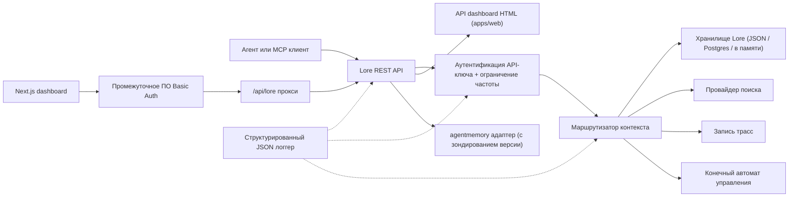

> 🤖 Этот документ был переведён машинным способом с английского. Приветствуются улучшения через PR — см. [руководство по переводу](../README.md).

# Архитектура

Lore Context — это управляющий уровень с приоритетом локальной работы для памяти, поиска, трасс,
оценки качества, миграции и управления. v0.4.0-alpha представляет собой TypeScript монорепозиторий,
развёртываемый как один процесс или небольшой стек Docker Compose.

## Карта компонентов

| Компонент | Путь | Роль |
|---|---|---|
| API | `apps/api` | REST управляющий уровень, аутентификация, ограничение частоты, структурированный логгер, graceful shutdown |
| Dashboard | `apps/dashboard` | Операторский UI Next.js 16 за промежуточным ПО HTTP Basic Auth |
| MCP Server | `apps/mcp-server` | stdio MCP поверхность (legacy + официальный SDK транспорт) с zod-валидацией ввода инструментов |
| Web HTML | `apps/web` | Серверный HTML резервный UI, поставляемый вместе с API |
| Общие типы | `packages/shared` | `MemoryRecord`, `ContextQueryResponse`, `EvalMetrics`, `AuditLog`, ошибки, ID утилиты |
| Адаптер AgentMemory | `packages/agentmemory-adapter` | Мост к upstream среде выполнения `agentmemory` с зондированием версии и режимом деградации |
| Search | `packages/search` | Подключаемые провайдеры поиска (BM25, hybrid) |
| MIF | `packages/mif` | Memory Interchange Format v0.2 — экспорт/импорт JSON + Markdown |
| Eval | `packages/eval` | `EvalRunner` + примитивы метрик (Recall@K, Precision@K, MRR, staleHit, p95) |
| Governance | `packages/governance` | Шестисостояний конечный автомат, сканирование тегов риска, эвристика отравления, аудит-журнал |

## Форма среды выполнения

API имеет минимальные зависимости и поддерживает три уровня хранения:

1. **В памяти** (по умолчанию, без env): подходит для юнит-тестов и эфемерных локальных запусков.
2. **JSON-файл** (`LORE_STORE_PATH=./data/lore-store.json`): устойчивый на одном хосте;
   инкрементальный сброс после каждой мутации. Рекомендуется для одиночной разработки.
3. **Postgres + pgvector** (`LORE_STORE_DRIVER=postgres`): хранилище производственного уровня
   с инкрементальными upsert от одного писателя и явным распространением жёсткого удаления.
   Схема находится в `apps/api/src/db/schema.sql` и поставляется с B-tree индексами по
   `(project_id)`, `(status)`, `(created_at)` плюс GIN индексы по jsonb-столбцам
   `content` и `metadata`. `LORE_POSTGRES_AUTO_SCHEMA` по умолчанию `false` в v0.4.0-alpha —
   применяйте схему явно через `pnpm db:schema`.

Составление контекста внедряет только `active` записи памяти. Записи `candidate`, `flagged`,
`redacted`, `superseded` и `deleted` остаются доступными для инспекции через инвентарь и
аудит-пути, но отфильтровываются из контекста агента.

Каждый составленный идентификатор памяти записывается обратно в хранилище с `useCount` и
`lastUsedAt`. Обратная связь по трассам отмечает контекстный запрос как `useful` / `wrong` /
`outdated` / `sensitive`, создавая аудит-событие для последующей проверки качества.

## Поток управления

Конечный автомат в `packages/governance/src/state.ts` определяет шесть состояний и
явную таблицу допустимых переходов:

```text
candidate ──approve──► active
candidate ──auto risk──► flagged
candidate ──auto severe risk──► redacted

active ──manual flag──► flagged
active ──new memory replaces──► superseded
active ──manual delete──► deleted

flagged ──approve──► active
flagged ──redact──► redacted
flagged ──reject──► deleted

redacted ──manual delete──► deleted
```

Недопустимые переходы вызывают исключение. Каждый переход добавляется в неизменяемый аудит-журнал
через `writeAuditEntry` и отображается в `GET /v1/governance/audit-log`.

`classifyRisk(content)` запускает сканер на основе регулярных выражений по полезной нагрузке записи
и возвращает начальное состояние (`active` для чистого контента, `flagged` для умеренного риска,
`redacted` для серьёзного риска, такого как API-ключи или приватные ключи) плюс совпавшие `risk_tags`.

`detectPoisoning(memory, neighbors)` запускает эвристические проверки на отравление памяти:
доминирование одного источника (>80% недавних записей памяти от одного провайдера) плюс паттерны
императивных глаголов ("ignore previous", "always say" и т. д.). Возвращает
`{ suspicious, reasons }` для очереди оператора.

Редактирование памяти учитывает версию. Исправляйте на месте через `POST /v1/memory/:id/update`
для небольших исправлений; создавайте преемника через `POST /v1/memory/:id/supersede`, чтобы
пометить оригинал как `superseded`. Удаление является консервативным: `POST /v1/memory/forget`
выполняет мягкое удаление, если только вызывающий-администратор не передаёт `hard_delete: true`.

## Поток Eval

`packages/eval/src/runner.ts` предоставляет:

- `runEval(dataset, retrieve, opts)` — оркестрирует извлечение на наборе данных,
  вычисляет метрики, возвращает типизированный `EvalRunResult`.
- `persistRun(result, dir)` — записывает JSON-файл в `output/eval-runs/`.
- `loadRuns(dir)` — загружает сохранённые запуски.
- `diffRuns(prev, curr)` — создаёт дельту по каждой метрике и список `regressions` для
  проверки порогов в CI.

API предоставляет профили провайдеров через `GET /v1/eval/providers`. Текущие профили:

- `lore-local` — собственный стек поиска и составления Lore.
- `agentmemory-export` — оборачивает конечную точку smart-search upstream agentmemory;
  называется "export", потому что в v0.9.x он ищет наблюдения, а не свежезапомненные записи.
- `external-mock` — синтетический провайдер для дымового тестирования CI.

## Граница адаптера (`agentmemory`)

`packages/agentmemory-adapter` изолирует Lore от дрейфа upstream API:

- `validateUpstreamVersion()` считывает версию upstream `health()` и сравнивает с
  `SUPPORTED_AGENTMEMORY_RANGE` с использованием собственного сравнения semver.
- `LORE_AGENTMEMORY_REQUIRED=1` (по умолчанию): адаптер выбрасывает исключение при инициализации,
  если upstream недоступен или несовместим.
- `LORE_AGENTMEMORY_REQUIRED=0`: адаптер возвращает null/пустые значения из всех вызовов и
  выводит одно предупреждение. API остаётся активным, но маршруты на основе agentmemory деградируют.

## MIF v0.2

`packages/mif` определяет Memory Interchange Format. Каждый `LoreMemoryItem` несёт
полный набор данных провенанса:

```ts
{
  id: string;
  content: string;
  memory_type: string;
  project_id: string;
  scope: "project" | "global";
  governance: { state: GovState; risk_tags: string[] };
  validity: { from?: ISO-8601; until?: ISO-8601 };
  confidence?: number;
  source_refs?: string[];
  supersedes?: string[];      // записи памяти, которые эта заменяет
  contradicts?: string[];     // записи памяти, с которыми эта не согласна
  metadata?: Record<string, unknown>;
}
```

Цикл JSON и Markdown проверяется тестами. Путь импорта v0.1 → v0.2 обратно совместим —
старые конверты загружаются с пустыми массивами `supersedes`/`contradicts`.

## Локальный RBAC

API-ключи несут роли и необязательные области проекта:

- `LORE_API_KEY` — одиночный legacy admin-ключ.
- `LORE_API_KEYS` — JSON-массив записей `{ key, role, projectIds? }`.
- Режим с пустыми ключами: при `NODE_ENV=production` API завершается ошибкой. В dev
  вызывающие через loopback могут включить анонимного администратора через `LORE_ALLOW_ANON_LOOPBACK=1`.
- `reader`: маршруты чтения/контекста/трасс/результатов eval.
- `writer`: reader плюс запись/обновление/замена/забывание (мягкое) памяти, события, eval-запуски,
  обратная связь по трассам.
- `admin`: все маршруты, включая синхронизацию, import/export, жёсткое удаление, проверку управления
  и аудит-журнал.
- Список разрешений `projectIds` сужает видимые записи и принудительно требует явного `project_id`
  на мутирующих маршрутах для ограниченных писателей/администраторов. Для кросс-проектной
  синхронизации agentmemory требуются неограниченные admin-ключи.

## Поток запроса



## Нецели для v0.4.0-alpha

- Никакого прямого публичного раскрытия raw конечных точек `agentmemory`.
- Никакой управляемой облачной синхронизации (запланировано для v0.6).
- Никакого удалённого мультитенантного биллинга.
- Никакой упаковки OpenAPI/Swagger (запланировано для v0.5; прозаический справочник в
  `docs/api-reference.md` является авторитетным).
- Никакого автоматизированного непрерывного инструментария для перевода документации
  (PR от сообщества через `docs/i18n/`).

## Связанные документы

- [Начало работы](getting-started.md) — быстрый старт для разработчиков за 5 минут.
- [Справочник API](api-reference.md) — REST и MCP поверхность.
- [Развёртывание](deployment.md) — локальный, Postgres, Docker Compose.
- [Интеграции](integrations.md) — матрица настройки агент-IDE.
- [Политика безопасности](SECURITY.md) — раскрытие и встроенное усиление защиты.
- [Участие в разработке](CONTRIBUTING.md) — рабочий процесс разработки и формат коммитов.
- [Журнал изменений](CHANGELOG.md) — что и когда было выпущено.
- [Руководство участника i18n](../README.md) — переводы документации.
