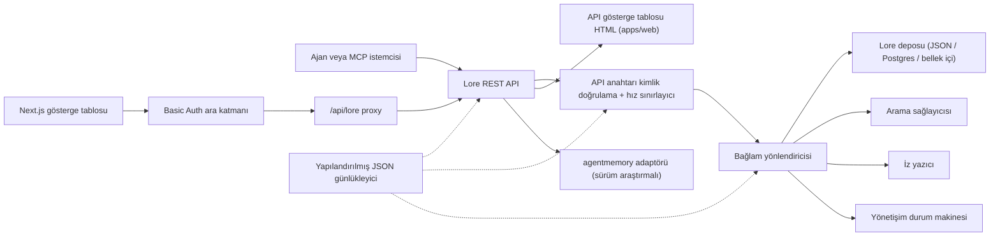

# Mimari

> 🤖 Bu belge İngilizce orijinalinden makine çevirisi ile oluşturulmuştur. PR ile iyileştirmeler memnuniyetle karşılanır — [çeviri katkı kılavuzuna](../README.md) bakın.

Lore Context, bellek, arama, izler, değerlendirme, göç ve yönetişim etrafında yerel
öncelikli bir kontrol düzlemidir. v0.4.0-alpha, tek bir süreç veya küçük bir Docker
Compose yığını olarak dağıtılabilir bir TypeScript monoreposudur.

## Bileşen Haritası

| Bileşen | Yol | Rol |
|---|---|---|
| API | `apps/api` | REST kontrol düzlemi, kimlik doğrulama, hız sınırı, yapılandırılmış günlükleyici, düzgün kapatma |
| Gösterge Tablosu | `apps/dashboard` | HTTP Basic Auth ara katmanı arkasında Next.js 16 operatör UI |
| MCP Sunucusu | `apps/mcp-server` | zod doğrulamalı araç girdileriyle stdio MCP yüzeyi (eski + resmi SDK taşımaları) |
| Web HTML | `apps/web` | API ile birlikte gönderilen sunucu taraflı HTML yedek UI |
| Paylaşılan tipler | `packages/shared` | `MemoryRecord`, `ContextQueryResponse`, `EvalMetrics`, `AuditLog`, hatalar, ID yardımcıları |
| AgentMemory adaptörü | `packages/agentmemory-adapter` | Sürüm araştırması ve düşük mod ile yukarı akış `agentmemory` çalışma zamanına köprü |
| Arama | `packages/search` | Takılabilir arama sağlayıcıları (BM25, hibrit) |
| MIF | `packages/mif` | Bellek Değişim Biçimi v0.2 — JSON + Markdown dışa/içe aktarma |
| Eval | `packages/eval` | `EvalRunner` + metrik temel öğeleri (Recall@K, Precision@K, MRR, staleHit, p95) |
| Yönetişim | `packages/governance` | Altı durumlu durum makinesi, risk etiketi taraması, zehirleme sezgiselleri, denetim günlüğü |

## Çalışma Zamanı Şekli

API bağımlılık açısından hafiftir ve üç depolama katmanını destekler:

1. **Bellek içi** (varsayılan, ortam değişkeni yok): birim testleri ve geçici yerel
   çalıştırmalar için uygundur.
2. **JSON dosya** (`LORE_STORE_PATH=./data/lore-store.json`): tek bir konakta dayanıklı;
   her mutasyondan sonra artımlı temizleme. Solo geliştirme için önerilir.
3. **Postgres + pgvector** (`LORE_STORE_DRIVER=postgres`): tek yazıcılı artımlı upsert
   ve açık zorlama silme yayılımıyla üretim kalitesinde depolama. Şema
   `apps/api/src/db/schema.sql` içinde bulunur ve `memory_records`, `context_traces`,
   `audit_logs`, `event_log`, `eval_runs` için `(project_id)`, `(status)`,
   `(created_at)` üzerinde B-tree indeksleri, jsonb `content` ve `metadata` sütunları
   üzerinde GIN indeksleri içerir. `LORE_POSTGRES_AUTO_SCHEMA` v0.4.0-alpha'da
   varsayılan olarak `false`'dur — `pnpm db:schema` aracılığıyla şemayı açıkça uygulayın.

Bağlam oluşturumu yalnızca `active` belleğini enjekte eder. `candidate`, `flagged`,
`redacted`, `superseded` ve `deleted` kayıtlar envanter ve denetim yolları üzerinden
incelenebilir kalır ancak ajan bağlamından filtrelenir.

Her oluşturulmuş bellek kimliği `useCount` ve `lastUsedAt` ile depoya geri kaydedilir.
İz geri bildirimi bir bağlam sorgusunu `useful` / `wrong` / `outdated` / `sensitive`
olarak işaretler ve sonraki kalite incelemesi için bir denetim olayı oluşturur.

## Yönetişim Akışı

`packages/governance/src/state.ts` içindeki durum makinesi altı durumu ve açık
yasal geçiş tablosunu tanımlar:

```text
candidate ──onayla──► active
candidate ──otomatik risk──► flagged
candidate ──otomatik ciddi risk──► redacted

active ──elle işaretle──► flagged
active ──yeni bellek yerine geçer──► superseded
active ──elle sil──► deleted

flagged ──onayla──► active
flagged ──gizle──► redacted
flagged ──reddet──► deleted

redacted ──elle sil──► deleted
```

Geçersiz geçişler hata fırlatır. Her geçiş, `writeAuditEntry` aracılığıyla
değiştirilemez denetim günlüğüne eklenir ve `GET /v1/governance/audit-log`'da yüzeylenir.

`classifyRisk(content)`, bir yazma yükü üzerinde regex tabanlı tarayıcıyı çalıştırır
ve başlangıç durumunu (`active` temiz içerik için, `flagged` orta risk için, `redacted`
API anahtarları veya özel anahtarlar gibi ciddi risk için) ve eşleşen `risk_tags`'ı
döndürür.

`detectPoisoning(memory, neighbors)`, bellek zehirleme için sezgisel kontroller çalıştırır:
aynı kaynak baskınlığı (son belleklerin >%80'i tek sağlayıcıdan) artı emir kipi fiil
örüntüleri ("ignore previous", "always say" vb.). Operatör kuyruğu için
`{ suspicious, reasons }` döndürür.

Bellek düzenlemeleri sürüm farkındadır. Küçük düzeltmeler için `POST /v1/memory/:id/update`
aracılığıyla yerinde yama uygulayın; orijinali `superseded` olarak işaretlemek için
`POST /v1/memory/:id/supersede` aracılığıyla halef oluşturun. Unutma muhafazakardır:
`POST /v1/memory/forget` admin çağrıcı `hard_delete: true` geçirmediği sürece yumuşak
silme yapar.

## Değerlendirme Akışı

`packages/eval/src/runner.ts` şunları açıklar:

- `runEval(dataset, retrieve, opts)` — bir veri kümesine karşı getirmeyi düzenler,
  metrikleri hesaplar, tiplendirilmiş `EvalRunResult` döndürür.
- `persistRun(result, dir)` — `output/eval-runs/` altında bir JSON dosyası yazar.
- `loadRuns(dir)` — kaydedilmiş çalıştırmaları yükler.
- `diffRuns(prev, curr)` — CI dostu eşik kontrolü için metrik başına delta ve
  `regressions` listesi üretir.

API, `GET /v1/eval/providers` aracılığıyla sağlayıcı profillerini açıklar.
Mevcut profiller:

- `lore-local` — Lore'un kendi arama ve oluşturma yığını.
- `agentmemory-export` — yukarı akış agentmemory akıllı arama uç noktasını sarar;
  v0.9.x'te gözlemleri aradığı için "export" olarak adlandırılmış.
- `external-mock` — CI duman testi için sentetik sağlayıcı.

## Adaptör Sınırı (`agentmemory`)

`packages/agentmemory-adapter`, Lore'u yukarı akış API kaymasından yalıtır:

- `validateUpstreamVersion()`, yukarı akış `health()` sürümünü okur ve
  `SUPPORTED_AGENTMEMORY_RANGE`'e karşı el yapımı semver karşılaştırma kullanarak
  karşılaştırır.
- `LORE_AGENTMEMORY_REQUIRED=1` (varsayılan): yukarı akış ulaşılamaz veya uyumsuzsa
  adaptör başlatmada hata fırlatır.
- `LORE_AGENTMEMORY_REQUIRED=0`: adaptör tüm çağrılardan null/boş döndürür ve tek bir
  uyarı günlüğe kaydeder. API çalışır durumda kalır, ancak agentmemory destekli rotalar
  düşer.

## MIF v0.2

`packages/mif`, Bellek Değişim Biçimini tanımlar. Her `LoreMemoryItem` tam köken
kümesini taşır:

```ts
{
  id: string;
  content: string;
  memory_type: string;
  project_id: string;
  scope: "project" | "global";
  governance: { state: GovState; risk_tags: string[] };
  validity: { from?: ISO-8601; until?: ISO-8601 };
  confidence?: number;
  source_refs?: string[];
  supersedes?: string[];      // bu belleğin yerini aldığı bellekler
  contradicts?: string[];     // bu belleğin katılmadığı bellekler
  metadata?: Record<string, unknown>;
}
```

JSON ve Markdown gidiş-dönüşü testlerle doğrulanmıştır. v0.1 → v0.2 içe aktarma
yolu geriye dönük olarak uyumludur — eski zarflar boş `supersedes`/`contradicts`
dizileriyle yüklenir.

## Yerel RBAC

API anahtarları roller ve isteğe bağlı proje kapsamları taşır:

- `LORE_API_KEY` — tek eski admin anahtarı.
- `LORE_API_KEYS` — `{ key, role, projectIds? }` girdileri JSON dizisi.
- Boş anahtar modu: `NODE_ENV=production`'da API kapanır. Geliştirmede, loopback
  çağrıcılar `LORE_ALLOW_ANON_LOOPBACK=1` aracılığıyla anonim admin'i seçebilir.
- `reader`: okuma/bağlam/iz/eval sonuç rotaları.
- `writer`: reader artı bellek yazma/güncelleme/yenileme/unutma(yumuşak), olaylar,
  eval çalıştırmaları, iz geri bildirimi.
- `admin`: senkronizasyon, içe/dışa aktarma, zorlama silme, yönetişim incelemesi
  ve denetim günlüğü dahil tüm rotalar.
- `projectIds` izin listesi, görünür kayıtları daraltır ve kapsamlı yazarlar/adminler
  için değiştirme rotalarında açık `project_id` zorunlu kılar. Projeler arası
  agentmemory senkronizasyonu için kapsamsız admin anahtarları gereklidir.

## İstek Akışı



## v0.4.0-alpha İçin Hedef Dışı

- Ham `agentmemory` uç noktalarının doğrudan herkese açık maruziyeti yok.
- Yönetilen bulut senkronizasyonu yok (v0.6 için planlanmış).
- Uzaktan çok kiracılı faturalandırma yok.
- OpenAPI/Swagger paketleme yok (v0.5 için planlanmış; `docs/api-reference.md`'deki
  düz metin referansı yetkilidir).
- Belgeler için otomatik sürekli çeviri araçları yok (topluluk PR'ları
  `docs/i18n/` aracılığıyla).

## İlgili Belgeler

- [Başlarken](getting-started.md) — 5 dakikalık geliştirici hızlı başlangıcı.
- [API Referansı](api-reference.md) — REST ve MCP yüzeyi.
- [Dağıtım](deployment.md) — yerel, Postgres, Docker Compose.
- [Entegrasyonlar](integrations.md) — ajan-IDE kurulum matrisi.
- [Güvenlik Politikası](SECURITY.md) — açıklama ve yerleşik sertleştirme.
- [Katkıda Bulunma](CONTRIBUTING.md) — geliştirme iş akışı ve commit biçimi.
- [Değişiklik Günlüğü](CHANGELOG.md) — ne zaman ne gönderildi.
- [i18n Katkı Kılavuzu](../README.md) — belge çevirileri.
