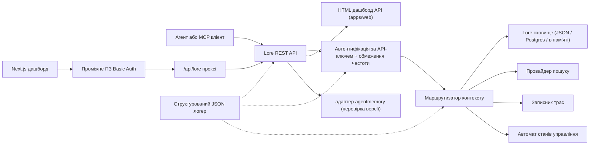

> 🤖 Цей документ перекладено машинним способом з англійської. Вітаємо покращення через PR — див. [посібник з перекладу](../README.md).

# Архітектура

Lore Context — це площина управління з пріоритетом локальності навколо пам'яті,
пошуку, трас, оцінювання, міграції та управління. v0.4.0-alpha — це TypeScript
монорепозиторій, що розгортається як єдиний процес або невеликий Docker Compose стек.

## Карта компонентів

| Компонент | Шлях | Роль |
|---|---|---|
| API | `apps/api` | REST площина управління, автентифікація, обмеження частоти, структурований логер, плавне завершення |
| Dashboard | `apps/dashboard` | Next.js 16 операторський UI за проміжним ПЗ HTTP Basic Auth |
| MCP Server | `apps/mcp-server` | stdio MCP поверхня (legacy + офіційний SDK транспорт) з zod-валідованими вхідними даними інструментів |
| Web HTML | `apps/web` | Серверно-рендерений HTML резервний UI, що постачається разом з API |
| Спільні типи | `packages/shared` | `MemoryRecord`, `ContextQueryResponse`, `EvalMetrics`, `AuditLog`, помилки, утиліти ID |
| Адаптер AgentMemory | `packages/agentmemory-adapter` | Міст до upstream `agentmemory` рушія з перевіркою версії та режимом деградації |
| Search | `packages/search` | Підключні провайдери пошуку (BM25, hybrid) |
| MIF | `packages/mif` | Memory Interchange Format v0.2 — JSON + Markdown експорт/імпорт |
| Eval | `packages/eval` | `EvalRunner` + примітиви метрик (Recall@K, Precision@K, MRR, staleHit, p95) |
| Governance | `packages/governance` | Шестистанний автомат, сканування тегів ризику, евристика отруєння, журнал аудиту |

## Форма рушія

API є незалежним від залежностей та підтримує три рівні зберігання:

1. **В пам'яті** (за замовчуванням, без env): підходить для модульних тестів та
   ефемерних локальних запусків.
2. **JSON-файл** (`LORE_STORE_PATH=./data/lore-store.json`): довготривале на одному
   хості; інкрементальне скидання після кожної мутації. Рекомендується для одиночної
   розробки.
3. **Postgres + pgvector** (`LORE_STORE_DRIVER=postgres`): зберігання виробничого рівня
   з одно-записувальними інкрементальними upsert та явним розповсюдженням жорсткого
   видалення. Схема знаходиться в `apps/api/src/db/schema.sql` та постачається з
   B-tree індексами на `(project_id)`, `(status)`, `(created_at)` плюс GIN індекси
   на jsonb стовпцях `content` та `metadata`. `LORE_POSTGRES_AUTO_SCHEMA` за
   замовчуванням `false` у v0.4.0-alpha — застосовуйте схему явно через
   `pnpm db:schema`.

Компоновка контексту вставляє лише `active` пам'яті. Записи `candidate`, `flagged`,
`redacted`, `superseded` та `deleted` залишаються перевіряємими через шляхи
інвентаризації та аудиту, але фільтруються з контексту агента.

Кожен складений ідентифікатор пам'яті записується назад до сховища з `useCount` та
`lastUsedAt`. Зворотний зв'язок трас позначає запит контексту `useful` / `wrong` /
`outdated` / `sensitive`, створюючи подію аудиту для наступної перевірки якості.

## Потік управління

Автомат станів у `packages/governance/src/state.ts` визначає шість станів та явну
таблицю допустимих переходів:

```text
candidate ──approve──► active
candidate ──auto risk──► flagged
candidate ──auto severe risk──► redacted

active ──manual flag──► flagged
active ──new memory replaces──► superseded
active ──manual delete──► deleted

flagged ──approve──► active
flagged ──redact──► redacted
flagged ──reject──► deleted

redacted ──manual delete──► deleted
```

Недопустимі переходи спричиняють виключення. Кожен перехід додається до незмінного
журналу аудиту через `writeAuditEntry` та відображається в
`GET /v1/governance/audit-log`.

`classifyRisk(content)` запускає сканер на основі регулярних виразів над корисним
навантаженням запису та повертає початковий стан (`active` для чистого контенту,
`flagged` для помірного ризику, `redacted` для серйозного ризику, як API ключі або
приватні ключі) плюс відповідні `risk_tags`.

`detectPoisoning(memory, neighbors)` виконує евристичні перевірки на предмет
отруєння пам'яті: домінування одного джерела (>80% останніх пам'ятей від одного
провайдера) плюс шаблони наказових дієслів ("ignore previous", "always say" тощо).
Повертає `{ suspicious, reasons }` для черги оператора.

Редагування пам'яті є версійно-aware. Патч на місці через
`POST /v1/memory/:id/update` для невеликих виправлень; створення наступника через
`POST /v1/memory/:id/supersede` для позначення оригінального як `superseded`.
Забування є консервативним: `POST /v1/memory/forget` виконує м'яке видалення, якщо
адміністратор не передає `hard_delete: true`.

## Потік Eval

`packages/eval/src/runner.ts` надає:

- `runEval(dataset, retrieve, opts)` — організовує отримання проти набору даних,
  обчислює метрики, повертає типізований `EvalRunResult`.
- `persistRun(result, dir)` — записує JSON файл у `output/eval-runs/`.
- `loadRuns(dir)` — завантажує збережені запуски.
- `diffRuns(prev, curr)` — виробляє дельту метрик та список `regressions` для
  перевірки порогів у CI.

API надає профілі провайдерів через `GET /v1/eval/providers`. Поточні профілі:

- `lore-local` — власний стек пошуку та компоновки Lore.
- `agentmemory-export` — обгортає upstream ендпоінт розумного пошуку agentmemory;
  називається "export", оскільки у v0.9.x він шукає спостереження, а не щойно
  запам'ятовані записи.
- `external-mock` — синтетичний провайдер для димового тестування CI.

## Межа адаптера (`agentmemory`)

`packages/agentmemory-adapter` ізолює Lore від дрейфу upstream API:

- `validateUpstreamVersion()` читає версію upstream `health()` та порівнює з
  `SUPPORTED_AGENTMEMORY_RANGE` за допомогою власної реалізації semver порівняння.
- `LORE_AGENTMEMORY_REQUIRED=1` (за замовчуванням): адаптер спричиняє виключення при
  ініціалізації, якщо upstream недосяжний або несумісний.
- `LORE_AGENTMEMORY_REQUIRED=0`: адаптер повертає null/порожнє з усіх викликів та
  записує одне попередження. API залишається активним, але маршрути, підкріплені
  agentmemory, деградують.

## MIF v0.2

`packages/mif` визначає Memory Interchange Format. Кожен `LoreMemoryItem` несе
повний набір провенансу:

```ts
{
  id: string;
  content: string;
  memory_type: string;
  project_id: string;
  scope: "project" | "global";
  governance: { state: GovState; risk_tags: string[] };
  validity: { from?: ISO-8601; until?: ISO-8601 };
  confidence?: number;
  source_refs?: string[];
  supersedes?: string[];      // пам'яті, які ця замінює
  contradicts?: string[];     // пам'яті, з якими ця не погоджується
  metadata?: Record<string, unknown>;
}
```

Кругова поїздка JSON та Markdown перевіряється тестами. Шлях імпорту v0.1 → v0.2
є сумісним назад — старіші конверти завантажуються з порожніми масивами
`supersedes`/`contradicts`.

## Локальний RBAC

API ключі несуть ролі та опціональні обмеження до проекту:

- `LORE_API_KEY` — одинарний legacy адміністративний ключ.
- `LORE_API_KEYS` — JSON масив записів `{ key, role, projectIds? }`.
- Режим порожніх ключів: при `NODE_ENV=production` API блокується. У розробці,
  loopback виклики можуть обрати анонімного адміністратора через
  `LORE_ALLOW_ANON_LOOPBACK=1`.
- `reader`: маршрути читання/контексту/трас/результатів eval.
- `writer`: reader плюс запис/оновлення/заміна/забування пам'яті (м'яке), події,
  запуски eval, зворотний зв'язок трас.
- `admin`: всі маршрути, включаючи синхронізацію, імпорт/експорт, жорстке видалення,
  перевірку управління та журнал аудиту.
- Список дозволів `projectIds` звужує видимі записи та змушує явно вказувати
  `project_id` на мутаційних маршрутах для обмежених writer/admin. Необмежені
  адміністративні ключі потрібні для крос-проектної синхронізації agentmemory.

## Потік запиту



## Не-цілі для v0.4.0-alpha

- Ніякого прямого публічного відкриття raw `agentmemory` ендпоінтів.
- Ніякої керованої хмарної синхронізації (заплановано для v0.6).
- Ніякого дистанційного багатоорендного білінгу.
- Ніякого пакування OpenAPI/Swagger (заплановано для v0.5; посилання у прозі в
  `docs/api-reference.md` є авторитетним).
- Ніякого автоматизованого безперервного інструментарію перекладу документації
  (PR від спільноти через `docs/i18n/`).

## Пов'язані документи

- [Початок роботи](getting-started.md) — 5-хвилинний швидкий старт для розробників.
- [Довідник API](api-reference.md) — REST та MCP поверхня.
- [Розгортання](deployment.md) — локальне, Postgres, Docker Compose.
- [Інтеграції](integrations.md) — матриця налаштування agent-IDE.
- [Політика безпеки](SECURITY.md) — розкриття та вбудоване зміцнення.
- [Участь у розробці](CONTRIBUTING.md) — робочий процес розробки та формат комітів.
- [Журнал змін](CHANGELOG.md) — що було випущено і коли.
- [Посібник учасника i18n](../README.md) — переклади документації.
