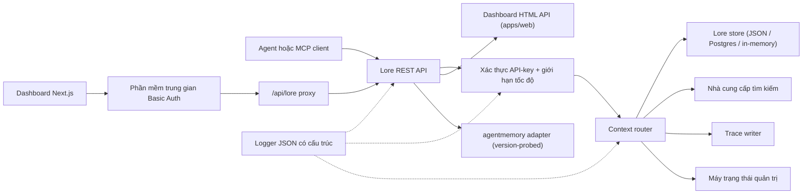

> 🤖 Tài liệu này được dịch máy từ bản tiếng Anh. Hoan nghênh cải thiện qua PR — xem [hướng dẫn đóng góp dịch thuật](../README.md).

# Kiến trúc

Lore Context là một mặt phẳng điều khiển ưu tiên cục bộ xung quanh bộ nhớ, tìm kiếm, dấu vết, đánh giá,
di chuyển và quản trị. v0.4.0-alpha là một TypeScript monorepo có thể triển khai như một
process duy nhất hoặc một stack Docker Compose nhỏ.

## Bản đồ thành phần

| Thành phần | Đường dẫn | Vai trò |
|---|---|---|
| API | `apps/api` | Mặt phẳng điều khiển REST, xác thực, giới hạn tốc độ, logger có cấu trúc, tắt máy nhẹ nhàng |
| Dashboard | `apps/dashboard` | UI vận hành Next.js 16 sau phần mềm trung gian HTTP Basic Auth |
| MCP Server | `apps/mcp-server` | Bề mặt MCP stdio (transport SDK legacy + chính thức) với đầu vào công cụ được xác thực bằng zod |
| Web HTML | `apps/web` | UI dự phòng HTML render phía server được vận chuyển cùng API |
| Kiểu dùng chung | `packages/shared` | `MemoryRecord`, `ContextQueryResponse`, `EvalMetrics`, `AuditLog`, lỗi, tiện ích ID |
| Adapter AgentMemory | `packages/agentmemory-adapter` | Cầu nối đến runtime `agentmemory` upstream với thăm dò phiên bản và chế độ giảm thiểu |
| Tìm kiếm | `packages/search` | Nhà cung cấp tìm kiếm có thể cắm (BM25, hybrid) |
| MIF | `packages/mif` | Memory Interchange Format v0.2 — xuất/nhập JSON + Markdown |
| Eval | `packages/eval` | `EvalRunner` + nguyên thủy chỉ số (Recall@K, Precision@K, MRR, staleHit, p95) |
| Quản trị | `packages/governance` | Máy trạng thái sáu trạng thái, quét thẻ rủi ro, heuristic đầu độc, nhật ký kiểm toán |

## Hình dạng Runtime

API có ít phụ thuộc và hỗ trợ ba tầng lưu trữ:

1. **Trong bộ nhớ** (mặc định, không có env): phù hợp cho unit test và lần chạy cục bộ ephemeral.
2. **File JSON** (`LORE_STORE_PATH=./data/lore-store.json`): bền vững trên một host duy nhất;
   flush tăng dần sau mỗi thay đổi. Khuyến nghị cho phát triển solo.
3. **Postgres + pgvector** (`LORE_STORE_DRIVER=postgres`): lưu trữ cấp sản xuất
   với upsert tăng dần single-writer và hard-delete rõ ràng.
   Schema nằm tại `apps/api/src/db/schema.sql` và được vận chuyển với chỉ mục B-tree trên
   `(project_id)`, `(status)`, `(created_at)` cộng thêm chỉ mục GIN trên các cột jsonb
   `content` và `metadata`. `LORE_POSTGRES_AUTO_SCHEMA` mặc định là `false`
   trong v0.4.0-alpha — áp dụng schema rõ ràng qua `pnpm db:schema`.

Tổng hợp ngữ cảnh chỉ inject các bộ nhớ `active`. Các bản ghi `candidate`, `flagged`,
`redacted`, `superseded` và `deleted` vẫn có thể kiểm tra qua các đường kiểm kê
và kiểm toán nhưng bị lọc khỏi ngữ cảnh agent.

Mọi id bộ nhớ được tổng hợp đều được ghi lại vào store với `useCount` và
`lastUsedAt`. Phản hồi trace đánh dấu truy vấn ngữ cảnh là `useful` / `wrong` / `outdated` /
`sensitive`, tạo ra sự kiện kiểm toán để xem xét chất lượng sau này.

## Luồng quản trị

Máy trạng thái trong `packages/governance/src/state.ts` định nghĩa sáu trạng thái và
bảng chuyển đổi hợp pháp rõ ràng:

```text
candidate ──approve──► active
candidate ──auto risk──► flagged
candidate ──auto severe risk──► redacted

active ──manual flag──► flagged
active ──new memory replaces──► superseded
active ──manual delete──► deleted

flagged ──approve──► active
flagged ──redact──► redacted
flagged ──reject──► deleted

redacted ──manual delete──► deleted
```

Các chuyển đổi bất hợp pháp throw. Mọi chuyển đổi đều được append vào nhật ký kiểm toán bất biến
qua `writeAuditEntry` và hiển thị trong `GET /v1/governance/audit-log`.

`classifyRisk(content)` chạy scanner dựa trên regex trên payload ghi và trả về
trạng thái ban đầu (`active` cho nội dung sạch, `flagged` cho rủi ro vừa, `redacted`
cho rủi ro nghiêm trọng như API key hoặc private key) cộng thêm `risk_tags` đã khớp.

`detectPoisoning(memory, neighbors)` chạy kiểm tra heuristic cho đầu độc bộ nhớ:
ưu thế cùng nguồn (>80% bộ nhớ gần đây từ một nhà cung cấp duy nhất) cộng thêm
các mẫu động từ mệnh lệnh ("ignore previous", "always say", v.v.). Trả về
`{ suspicious, reasons }` cho hàng đợi vận hành viên.

Chỉnh sửa bộ nhớ có nhận thức phiên bản. Patch tại chỗ qua `POST /v1/memory/:id/update` cho
các sửa nhỏ; tạo người kế tiếp qua `POST /v1/memory/:id/supersede` để đánh dấu
bản gốc là `superseded`. Quên là bảo thủ: `POST /v1/memory/forget`
soft-delete trừ khi caller admin truyền `hard_delete: true`.

## Luồng Eval

`packages/eval/src/runner.ts` expose:

- `runEval(dataset, retrieve, opts)` — điều phối truy xuất trên một bộ dữ liệu,
  tính toán chỉ số, trả về `EvalRunResult` có kiểu.
- `persistRun(result, dir)` — ghi file JSON trong `output/eval-runs/`.
- `loadRuns(dir)` — tải các lần chạy đã lưu.
- `diffRuns(prev, curr)` — tạo delta per-metric và danh sách `regressions` để
  kiểm tra ngưỡng thân thiện với CI.

API expose các hồ sơ nhà cung cấp qua `GET /v1/eval/providers`. Các hồ sơ hiện tại:

- `lore-local` — Stack tìm kiếm và tổng hợp của Lore.
- `agentmemory-export` — bọc endpoint agentmemory smart-search upstream;
  được đặt tên là "export" vì trong v0.9.x nó tìm kiếm các observation chứ không phải các bản ghi bộ nhớ mới được ghi nhớ trực tiếp.
- `external-mock` — nhà cung cấp tổng hợp cho CI smoke testing.

## Ranh giới Adapter (`agentmemory`)

`packages/agentmemory-adapter` cách ly Lore khỏi sự trôi dạt API upstream:

- `validateUpstreamVersion()` đọc phiên bản `health()` upstream và so sánh với
  `SUPPORTED_AGENTMEMORY_RANGE` sử dụng so sánh semver tự viết tay.
- `LORE_AGENTMEMORY_REQUIRED=1` (mặc định): adapter throw khi init nếu upstream không
  thể tiếp cận hoặc không tương thích.
- `LORE_AGENTMEMORY_REQUIRED=0`: adapter trả về null/empty từ tất cả các cuộc gọi và
  ghi một cảnh báo duy nhất. API vẫn hoạt động, nhưng các route được hỗ trợ bởi agentmemory giảm thiểu.

## MIF v0.2

`packages/mif` định nghĩa Memory Interchange Format. Mỗi `LoreMemoryItem` mang
bộ nguồn gốc đầy đủ:

```ts
{
  id: string;
  content: string;
  memory_type: string;
  project_id: string;
  scope: "project" | "global";
  governance: { state: GovState; risk_tags: string[] };
  validity: { from?: ISO-8601; until?: ISO-8601 };
  confidence?: number;
  source_refs?: string[];
  supersedes?: string[];      // bộ nhớ mà cái này thay thế
  contradicts?: string[];     // bộ nhớ mà cái này không đồng ý
  metadata?: Record<string, unknown>;
}
```

Round-trip JSON và Markdown được xác minh qua các test. Đường nhập v0.1 → v0.2 là
tương thích ngược — các envelope cũ tải với mảng `supersedes`/`contradicts` trống.

## RBAC cục bộ

API key mang các role và phạm vi dự án tùy chọn:

- `LORE_API_KEY` — admin key legacy đơn lẻ.
- `LORE_API_KEYS` — mảng JSON của các entry `{ key, role, projectIds? }`.
- Chế độ không có key: trong `NODE_ENV=production`, API thất bại đóng. Trong dev, caller loopback
  có thể opt-in vào admin ẩn danh qua `LORE_ALLOW_ANON_LOOPBACK=1`.
- `reader`: các route read/context/trace/eval-result.
- `writer`: reader cộng thêm write/update/supersede/forget(soft) bộ nhớ, event, eval
  run, phản hồi trace.
- `admin`: tất cả các route bao gồm sync, nhập/xuất, hard delete, xem xét quản trị,
  và nhật ký kiểm toán.
- Allow-list `projectIds` thu hẹp các bản ghi hiển thị và buộc `project_id` rõ ràng
  trên các route thay đổi cho các writer/admin theo phạm vi. Admin key không theo phạm vi là bắt buộc cho
  đồng bộ agentmemory cross-project.

## Luồng Request



## Mục tiêu không phải cho v0.4.0-alpha

- Không có exposure trực tiếp công khai của endpoint `agentmemory` thô.
- Không có đồng bộ cloud được quản lý (kế hoạch cho v0.6).
- Không có thanh toán đa tenant từ xa.
- Không có đóng gói OpenAPI/Swagger (kế hoạch cho v0.5; tham chiếu prose trong
  `docs/api-reference.md` là có thẩm quyền).
- Không có công cụ dịch tự động liên tục cho tài liệu (PR cộng đồng
  qua `docs/i18n/`).

## Tài liệu liên quan

- [Bắt đầu](getting-started.md) — hướng dẫn khởi động nhanh cho developer trong 5 phút.
- [Tham chiếu API](api-reference.md) — bề mặt REST và MCP.
- [Triển khai](deployment.md) — cục bộ, Postgres, Docker Compose.
- [Tích hợp](integrations.md) — ma trận thiết lập IDE agent.
- [Chính sách bảo mật](SECURITY.md) — tiết lộ và tăng cường tích hợp.
- [Đóng góp](CONTRIBUTING.md) — quy trình phát triển và định dạng commit.
- [Nhật ký thay đổi](CHANGELOG.md) — những gì đã được vận chuyển khi nào.
- [Hướng dẫn đóng góp i18n](../README.md) — dịch tài liệu.
