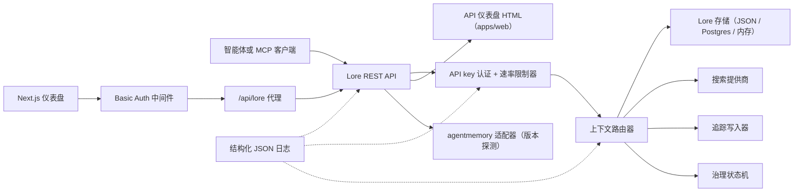

# 架构

> 🤖 本文档由英文版机器翻译生成。欢迎通过 PR 改进 — 参见[翻译贡献指南](../README.md)。

Lore Context 是围绕记忆、搜索、追踪、评测、迁移和治理构建的本地优先控制平面。v0.4.0-alpha 是一个 TypeScript monorepo，可作为单进程或小型 Docker Compose 栈部署。

## 组件地图

| 组件 | 路径 | 职责 |
|---|---|---|
| API | `apps/api` | REST 控制平面、认证、速率限制、结构化日志、优雅关闭 |
| 仪表盘 | `apps/dashboard` | HTTP Basic Auth 中间件保护的 Next.js 16 运营商 UI |
| MCP 服务器 | `apps/mcp-server` | stdio MCP 接口（legacy + 官方 SDK 传输），含 zod 验证的工具输入 |
| Web HTML | `apps/web` | 与 API 一起发布的服务端渲染 HTML 回退 UI |
| 共享类型 | `packages/shared` | `MemoryRecord`、`ContextQueryResponse`、`EvalMetrics`、`AuditLog`、错误、ID 工具 |
| AgentMemory 适配器 | `packages/agentmemory-adapter` | 连接上游 `agentmemory` 运行时的桥，含版本探测和降级模式 |
| 搜索 | `packages/search` | 可插拔搜索提供商（BM25、混合） |
| MIF | `packages/mif` | 记忆互换格式 v0.2 — JSON + Markdown 导出/导入 |
| 评测 | `packages/eval` | `EvalRunner` + 指标原语（Recall@K、Precision@K、MRR、staleHit、p95） |
| 治理 | `packages/governance` | 六状态状态机、风险标签扫描、投毒启发式算法、审计日志 |

## 运行时形态

API 依赖轻量，支持三种存储层：

1. **内存存储**（默认，无环境变量）：适合单元测试和临时本地运行。
2. **JSON 文件**（`LORE_STORE_PATH=./data/lore-store.json`）：在单机上持久化；每次变更后增量刷新。推荐用于单人开发。
3. **Postgres + pgvector**（`LORE_STORE_DRIVER=postgres`）：生产级存储，含单写入者增量 upsert 和显式硬删除传播。Schema 位于 `apps/api/src/db/schema.sql`，并附带 `(project_id)`、`(status)`、`(created_at)` 上的 B-tree 索引，以及 jsonb `content` 和 `metadata` 列上的 GIN 索引。`LORE_POSTGRES_AUTO_SCHEMA` 在 v0.4.0-alpha 中默认为 `false` — 通过 `pnpm db:schema` 显式应用 schema。

上下文组合只注入 `active` 状态的记忆。`candidate`、`flagged`、`redacted`、`superseded` 和 `deleted` 记录可通过清单和审计路径查看，但会从智能体上下文中过滤掉。

每条被组合的记忆 id 都会被记录回存储，更新 `useCount` 和 `lastUsedAt`。追踪反馈将上下文查询标记为 `useful` / `wrong` / `outdated` / `sensitive`，为后续质量审查创建审计事件。

## 治理流程

`packages/governance/src/state.ts` 中的状态机定义了六个状态和显式合法转换表：

```text
candidate ──approve──► active
candidate ──auto risk──► flagged
candidate ──auto severe risk──► redacted

active ──manual flag──► flagged
active ──new memory replaces──► superseded
active ──manual delete──► deleted

flagged ──approve──► active
flagged ──redact──► redacted
flagged ──reject──► deleted

redacted ──manual delete──► deleted
```

非法转换会抛出异常。每次转换都通过 `writeAuditEntry` 追加到不可变审计日志，并在 `GET /v1/governance/audit-log` 中可见。

`classifyRisk(content)` 对写入载荷运行基于正则的扫描器，返回初始状态（干净内容为 `active`，中等风险为 `flagged`，API key 或私钥等严重风险为 `redacted`）以及匹配的 `risk_tags`。

`detectPoisoning(memory, neighbors)` 对记忆投毒运行启发式检查：同源主导（最近记忆中超过 80% 来自单一提供商）加上命令动词模式（"ignore previous"、"always say" 等）。返回 `{ suspicious, reasons }` 供运营商队列使用。

记忆编辑是版本感知的。通过 `POST /v1/memory/:id/update` 原地修补以进行小修正；通过 `POST /v1/memory/:id/supersede` 创建后继记录以将原始记录标记为 `superseded`。遗忘是保守的：`POST /v1/memory/forget` 软删除，除非 admin 调用者传递 `hard_delete: true`。

## 评测流程

`packages/eval/src/runner.ts` 暴露：

- `runEval(dataset, retrieve, opts)` — 针对数据集编排检索，计算指标，返回类型化的 `EvalRunResult`。
- `persistRun(result, dir)` — 在 `output/eval-runs/` 下写入 JSON 文件。
- `loadRuns(dir)` — 加载已保存的运行结果。
- `diffRuns(prev, curr)` — 生成每指标的差值和 `regressions` 列表，用于 CI 友好的阈值检查。

API 通过 `GET /v1/eval/providers` 暴露提供商配置文件。当前配置文件：

- `lore-local` — Lore 自己的搜索和组合栈。
- `agentmemory-export` — 包装上游 agentmemory 智能搜索端点；命名为 "export" 是因为在 v0.9.x 中它搜索的是观察记录而非新写入的记忆记录。
- `external-mock` — CI 冒烟测试的合成提供商。

## 适配器边界（`agentmemory`）

`packages/agentmemory-adapter` 使 Lore 与上游 API 漂移隔离：

- `validateUpstreamVersion()` 读取上游 `health()` 版本，并使用手写 semver 比较与 `SUPPORTED_AGENTMEMORY_RANGE` 进行比对。
- `LORE_AGENTMEMORY_REQUIRED=1`（默认）：若上游不可达或不兼容，适配器在初始化时抛出异常。
- `LORE_AGENTMEMORY_REQUIRED=0`：适配器从所有调用返回 null/空并记录单条警告。API 保持运行，但 agentmemory 支持的路由降级。

## MIF v0.2

`packages/mif` 定义了记忆互换格式。每个 `LoreMemoryItem` 携带完整的来源集：

```ts
{
  id: string;
  content: string;
  memory_type: string;
  project_id: string;
  scope: "project" | "global";
  governance: { state: GovState; risk_tags: string[] };
  validity: { from?: ISO-8601; until?: ISO-8601 };
  confidence?: number;
  source_refs?: string[];
  supersedes?: string[];      // 此记忆替代的记忆
  contradicts?: string[];     // 此记忆与之矛盾的记忆
  metadata?: Record<string, unknown>;
}
```

JSON 和 Markdown 往返完整性通过测试验证。v0.1 → v0.2 导入路径向后兼容 — 旧信封以空 `supersedes`/`contradicts` 数组加载。

## 本地 RBAC

API key 携带角色和可选的项目作用域：

- `LORE_API_KEY` — 单一 legacy admin key。
- `LORE_API_KEYS` — `{ key, role, projectIds? }` 条目的 JSON 数组。
- 空 key 模式：在 `NODE_ENV=production` 下，API 安全失败。在开发环境下，回环调用者可以通过 `LORE_ALLOW_ANON_LOOPBACK=1` 选择匿名 admin。
- `reader`：读取/上下文/追踪/评测结果路由。
- `writer`：reader 加上记忆写入/更新/替代/遗忘（软），事件、评测运行、追踪反馈。
- `admin`：所有路由，包括同步、导入/导出、硬删除、治理审核和审计日志。
- `projectIds` 白名单缩小可见记录范围，并为作用域 writer/admin 的变更路由强制显式 `project_id`。跨项目 agentmemory 同步需要无作用域的 admin key。

## 请求流程



## v0.4.0-alpha 的非目标

- 不直接公开暴露原始 `agentmemory` 端点。
- 无托管云同步（计划在 v0.6 推出）。
- 无远程多租户计费。
- 无 OpenAPI/Swagger 打包（计划在 v0.5 推出；`docs/api-reference.md` 中的散文参考是权威文档）。
- 无自动化持续翻译文档工具（通过 `docs/i18n/` 的社区 PR）。

## 相关文档

- [快速入门](getting-started.md) — 5 分钟开发者快速入门。
- [API 参考](api-reference.md) — REST 和 MCP 接口。
- [部署](deployment.md) — 本地、Postgres、Docker Compose。
- [集成](integrations.md) — 智能体 IDE 配置矩阵。
- [安全策略](SECURITY.md) — 披露和内置加固。
- [贡献](CONTRIBUTING.md) — 开发工作流和提交格式。
- [变更日志](CHANGELOG.md) — 发布内容和时间。
- [i18n 贡献指南](../README.md) — 文档翻译。
