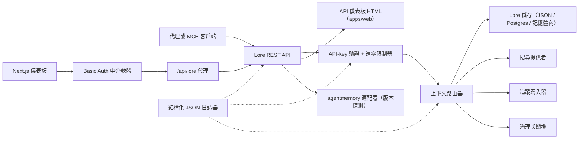

> 🤖 本文件由英文版機器翻譯產生。歡迎透過 PR 改進 — 參見[翻譯貢獻指南](../README.md)。

# 架構

Lore Context 是圍繞記憶體、搜尋、追蹤、評估、遷移和治理的本地優先控制平面。v0.4.0-alpha 是可部署為單一程序或小型 Docker Compose 堆疊的 TypeScript monorepo。

## 元件圖

| 元件 | 路徑 | 角色 |
|---|---|---|
| API | `apps/api` | REST 控制平面、驗證、速率限制、結構化日誌器、優雅關閉 |
| 儀表板 | `apps/dashboard` | HTTP Basic Auth 中介軟體後的 Next.js 16 操作員 UI |
| MCP 伺服器 | `apps/mcp-server` | stdio MCP 介面（傳統 + 官方 SDK 傳輸），含 zod 驗證工具輸入 |
| Web HTML | `apps/web` | 隨 API 一同提供的伺服器渲染 HTML 回退 UI |
| 共用型別 | `packages/shared` | `MemoryRecord`、`ContextQueryResponse`、`EvalMetrics`、`AuditLog`、錯誤、ID 工具 |
| AgentMemory 適配器 | `packages/agentmemory-adapter` | 橋接至上游 `agentmemory` 執行環境，含版本探測和降級模式 |
| 搜尋 | `packages/search` | 可插拔搜尋提供者（BM25、hybrid） |
| MIF | `packages/mif` | 記憶體交換格式 v0.2 — JSON + Markdown 匯出/匯入 |
| Eval | `packages/eval` | `EvalRunner` + 指標基元（Recall@K、Precision@K、MRR、staleHit、p95） |
| 治理 | `packages/governance` | 六狀態狀態機、風險標籤掃描、投毒啟發式方法、稽核日誌 |

## 執行環境形態

API 的依賴輕量，支援三種儲存層：

1. **記憶體內**（預設，無環境變數）：適合單元測試和臨時本地執行。
2. **JSON 檔案**（`LORE_STORE_PATH=./data/lore-store.json`）：單一主機上的持久化；每次變更後增量沖刷。建議用於個人開發。
3. **Postgres + pgvector**（`LORE_STORE_DRIVER=postgres`）：生產等級儲存，含單寫入者增量 upsert 和明確的硬刪除傳播。Schema 位於 `apps/api/src/db/schema.sql`，附帶 `(project_id)`、`(status)`、`(created_at)` 上的 B-tree 索引，以及 jsonb `content` 和 `metadata` 欄位的 GIN 索引。`LORE_POSTGRES_AUTO_SCHEMA` 在 v0.4.0-alpha 中預設為 `false` — 請透過 `pnpm db:schema` 明確套用 schema。

上下文組合僅注入 `active` 記憶體。`candidate`、`flagged`、`redacted`、`superseded` 和 `deleted` 記錄可透過清單和稽核路徑檢視，但從代理上下文中過濾掉。

每個組合的記憶體 id 都會以 `useCount` 和 `lastUsedAt` 記回儲存。追蹤回饋將上下文查詢標記為 `useful` / `wrong` / `outdated` / `sensitive`，為後續品質審查建立稽核事件。

## 治理流程

`packages/governance/src/state.ts` 中的狀態機定義了六個狀態和明確的合法轉換表：

```text
candidate ──approve──► active
candidate ──auto risk──► flagged
candidate ──auto severe risk──► redacted

active ──manual flag──► flagged
active ──new memory replaces──► superseded
active ──manual delete──► deleted

flagged ──approve──► active
flagged ──redact──► redacted
flagged ──reject──► deleted

redacted ──manual delete──► deleted
```

非法轉換會拋出例外。每次轉換都透過 `writeAuditEntry` 附加至不可變稽核日誌，並在 `GET /v1/governance/audit-log` 中呈現。

`classifyRisk(content)` 對寫入酬載執行基於正則的掃描，返回初始狀態（乾淨內容為 `active`，中等風險為 `flagged`，API key 或私鑰等嚴重風險為 `redacted`）以及相符的 `risk_tags`。

`detectPoisoning(memory, neighbors)` 執行記憶體投毒啟發式檢查：同源主導性（>80% 的近期記憶體來自單一提供者）加上命令式動詞模式（"ignore previous"、"always say" 等）。返回 `{ suspicious, reasons }` 以供操作員佇列使用。

記憶體編輯具版本感知能力。透過 `POST /v1/memory/:id/update` 就地修補以進行小幅修正；透過 `POST /v1/memory/:id/supersede` 建立後繼版本，將原版本標記為 `superseded`。遺忘操作保守處理：`POST /v1/memory/forget` 執行軟刪除，除非管理員呼叫者傳遞 `hard_delete: true`。

## Eval 流程

`packages/eval/src/runner.ts` 公開：

- `runEval(dataset, retrieve, opts)` — 針對資料集編排檢索、計算指標、返回型別化的 `EvalRunResult`。
- `persistRun(result, dir)` — 在 `output/eval-runs/` 下寫入 JSON 檔案。
- `loadRuns(dir)` — 載入已儲存的執行結果。
- `diffRuns(prev, curr)` — 產生每個指標的差值和 `regressions` 列表，用於 CI 友好的閾值檢查。

API 透過 `GET /v1/eval/providers` 公開提供者設定檔。目前的設定檔：

- `lore-local` — Lore 自身的搜尋和組合堆疊。
- `agentmemory-export` — 包裝上游 agentmemory 智慧搜尋端點；之所以命名為 "export"，是因為在 v0.9.x 中它搜尋的是觀察記錄而非新記憶的記錄。
- `external-mock` — 用於 CI 煙霧測試的合成提供者。

## 適配器邊界（`agentmemory`）

`packages/agentmemory-adapter` 使 Lore 與上游 API 漂移隔離：

- `validateUpstreamVersion()` 讀取上游 `health()` 版本，並使用手工實作的 semver 比較進行對照。
- `LORE_AGENTMEMORY_REQUIRED=1`（預設）：若上游不可達或不相容，適配器在初始化時拋出例外。
- `LORE_AGENTMEMORY_REQUIRED=0`：適配器從所有呼叫返回 null/空值，並記錄單次警告。API 保持運作，但 agentmemory 支援的路由降級。

## MIF v0.2

`packages/mif` 定義了記憶體交換格式。每個 `LoreMemoryItem` 攜帶完整的來源集：

```ts
{
  id: string;
  content: string;
  memory_type: string;
  project_id: string;
  scope: "project" | "global";
  governance: { state: GovState; risk_tags: string[] };
  validity: { from?: ISO-8601; until?: ISO-8601 };
  confidence?: number;
  source_refs?: string[];
  supersedes?: string[];      // 此記憶體取代的記憶體
  contradicts?: string[];     // 此記憶體與之矛盾的記憶體
  metadata?: Record<string, unknown>;
}
```

JSON 和 Markdown 往返一致性已透過測試驗證。v0.1 → v0.2 的匯入路徑向後相容 — 舊版信封以空的 `supersedes`/`contradicts` 陣列載入。

## 本地 RBAC

API key 攜帶角色和可選的專案範圍：

- `LORE_API_KEY` — 單一傳統管理員 key。
- `LORE_API_KEYS` — `{ key, role, projectIds? }` 條目的 JSON 陣列。
- 空 key 模式：在 `NODE_ENV=production` 中，API 封閉失敗。在開發環境中，回送呼叫者可透過 `LORE_ALLOW_ANON_LOOPBACK=1` 選擇匿名管理員。
- `reader`：讀取/上下文/追蹤/eval 結果路由。
- `writer`：reader 加上記憶體寫入/更新/取代/遺忘（軟）、事件、eval 執行、追蹤回饋。
- `admin`：所有路由，包括同步、匯入/匯出、硬刪除、治理審查和稽核日誌。
- `projectIds` 允許清單縮小可見記錄範圍，並在有範圍的 writer/admin 的變更路由上強制執行明確的 `project_id`。跨專案的 agentmemory 同步需要無範圍的管理員 key。

## 請求流程



## v0.4.0-alpha 的非目標

- 不直接公開原始 `agentmemory` 端點。
- 無託管雲端同步（計劃於 v0.6）。
- 無遠端多租戶計費。
- 無 OpenAPI/Swagger 打包（計劃於 v0.5；`docs/api-reference.md` 中的散文參考為權威文件）。
- 無自動連續翻譯文件的工具（透過 `docs/i18n/` 的社群 PR）。

## 相關文件

- [快速開始](getting-started.md) — 5 分鐘開發者快速開始。
- [API 參考](api-reference.md) — REST 和 MCP 介面。
- [部署](deployment.md) — 本地、Postgres、Docker Compose。
- [整合](integrations.md) — 代理 IDE 設定矩陣。
- [安全政策](SECURITY.md) — 揭露和內建強化。
- [貢獻](CONTRIBUTING.md) — 開發工作流程和提交格式。
- [更新日誌](CHANGELOG.md) — 什麼時候發布了什麼。
- [i18n 貢獻指南](../README.md) — 文件翻譯。
